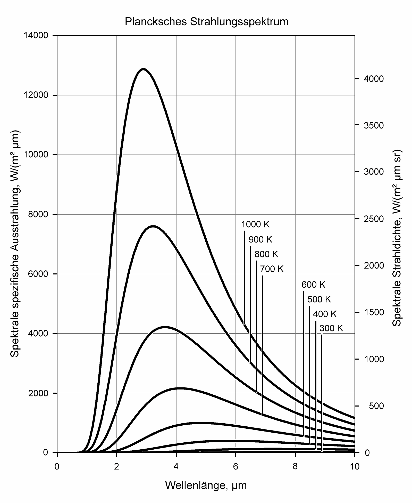

# Einleitung
Mithilfe von Spektroskopie ist es möglich, Absorptions- und Emissionsspektren von elektromagnetischen Wellen an einer Probe zu beobachten. Hierzu misst man spezifische Größen in Abhängigkeit von der Frequenz. Dadurch ist es möglich, Aussagen über die mikroskopischen Eigenschaften der Probe zu treffen.

Alternativ zur Frequenz werden auch äquivalente Größen wie der Wellenlänge oder Energie verwendet, um Größen wie die Intensität, die Strahlungsleistung und die Zählrate der Strahlung zu messen.

Dieser Versuch dient als Einführung in die Infrarotspektroskopie. Mithilfe eines niedrig auflösenden Absorptionsspektrometers wird die Infrarot-Absorption von Kohlenstoffdioxid $(\ce{CO_2})$ untersucht. Dieses Gas gehört zu den sogenannten "Treibhausgasen".

# Theoretische Grundlagen
## elektromagnetisches Spektrum
Es gibt verschiedene Frequenzbereiche elektromagnetischer Strahlung. Diese werden unter verschiedenen Namen zusammengefasst.

| Frequenzbereich         | Wellenlänge in $\mathrm m$ |
| ----------------------- | -------------------------- |
| Niederfrequenz          | $10^4$ bis $10^8$          |
| Radiowellen             | $10^1$ bis $10^3$          |
| Mikrowellen             | $10^{-3}$ bis $10^{0}$     |
| Infrarotstrahlung       | $10^{-6}$ bis $10^{-3}$    |
| sichtbares Licht        | $10^{-7}$                  |
| Ultraviolette Strahlung | $10^{-9}$ bis $10^{-7}$    |
| Röntgenstrahlung        | $10^{-11}$ bis $10^{-9}$   |
| Gammastrahlung          | $<10^{-11}$                |

### Photonen
Photonen sind die Austauschteilchen von elektromagnetischer Wechselwirkung. Sie haben keine Ruheenergie, ihre Energie $E$ ist über die Frequenz $\nu$ bzw. die Kreisfrequenz $\omega$ beschrieben. \cite{Fließbach}

$$
\begin{eqnarray}
	E &=& h\cdot \nu \\
		&=& \hbar \cdot \omega \\
    h &\approx& 6.62\cdot 10^{-34} \mathrm{\,Js}
    \end{eqnarray}
$$

Dabei findet die Planck-Konstante $h$ bzw. ihre reduzierte Form $\hbar$ Verwendung. Die Wellenlänge $\lambda$ bzw. die Wellenzahl $k$ können über die Lichtgeschwindigkeit $c$ aus der (Kreis-)Frequenz bestimmt werden.

$$
\begin{eqnarray}
    c &=& \lambda\nu \\
    c &=& k\omega
\end{eqnarray}
$$

Die Kreisfrequenz $\omega$ und die Wellenzahl $k$ sind proportional zu der Frequenz $\nu$ respektive der Wellenlänge $\lambda$.

$$
\begin{eqnarray}
    \omega &=& 2\pi \nu \\
	k &=& \frac{2\pi}{\lambda} \\
	\hbar &=& \frac{h}{2\pi}
\end{eqnarray}
$$

## Planck-Strahlung
Das Planck'sche Strahlungsgesetz beschreibt die Energiedichte $\omega_\mathrm{P}$, die ein schwarzer Körper mit einer Frequenz $\nu$ bei einer Temperatur $T$ als Wärmestrahlung aussendet. Dabei finden das Planck'sche Wirkungsquantum $h$, die Lichtgeschwindigkeit $c$ und die Boltzmann-Konstante $k_B$ Verwendung. \cite{Demtröder}

$$
\begin{eqnarray}
    \omega_\mathrm{P}(\nu,T) &=&
        \frac{8\pi\nu^2}{c^3}
        \frac{h\nu}{\exp\left[\frac{h\nu}{k_BT}\right]-1}
		\,\mathrm d\nu
        \tag{eq:PlackStrahlung}
\end{eqnarray}
$$

Der Faktor $\frac{8\pi\nu^2}{c^3}$ ist dabei die Dichte der Schwingungsmoden in einem Frequenzintervall, also die Anzahl erlaubter Schwingungszustände. Der Faktor $h\nu\cdot\exp[\dots]^{-1}$ beschreibt die mittlere kinetische Energie dieser Zustände.

### Strahlungsdichte
Die Strahldichte oder Strahlungsdichte $S$ beschreibt die Strahlung, die ein Flächenelement $\mathrm dA$ eines Strahlers in einen Raumwinkel $\mathrm d\Omega$ abstrahlt. Sie ist allgemein das Differential der Strahlungsleistung $\Phi$. \cite{Demtröder,Strahldichte}

$$
\begin{eqnarray}
	S &=& \frac{\mathrm d^2\Phi}{\mathrm dA \cdot \mathrm d\Omega}
\end{eqnarray}
$$

### Wien'sches Verschiebungsgesetz
Das Wien'sche Verschiebungsgesetz beschreibt abhängig von der Temperatur $T$, bei welcher Wellenlänge $\hat{\lambda}$ bzw. Frequenz $\hat{\nu}$ die größte Wärmeleistung abgestrahlt wird. Dadurch beschreibt es die Temperaturabhängigkeit des Maximums des Planck'schen Strahlungsgesetzes $(\mathrm{eq:PlackStrahlung})$.

$$
\begin{eqnarray}
	\hat{\lambda}\cdot T &=& 2.898\cdot10^{-3}\mathrm{\,m\cdot K}
		\tag{eq:WienLambda}\\
	\hat{\nu}\cdot T &=& 5.879\cdot10^{10} \mathrm{\,m\cdot Hz}
		\tag{eq:WienNu}
\end{eqnarray}
$$

## elektrisches Dipolmoment
Das elektrische Dipolmoment $\vec \mu$ ist das erste Moment aus der Multipolentwicklung einer Ladungsverteilung $\rho(\vec r)$. \cite{Dipolmoment} Es ist parallel zum elektrischen Feld $\vec E$ und beschreibt die Ungleichverteilung von Ladungen.

$$
\begin{eqnarray}
	\vec \mu &=& \int \vec r \rho(\vec r) \,\mathrm d^3\vec r
\end{eqnarray}
$$

Atome im Grundzustand haben kein permanentes Dipolmoment, Moleküle können dagegen ein permanentes Dipolmoment haben. Ein Beispiel dafür ist Wasser $(\ce{H_2O})$.

### Dipolübergang
Um ein Molekül durch die Absorption eines Photons anzuregen, muss ein Dipolübergang stattfinden. Dabei wird der quantenmechanische Zustand des Moleküls gestört, was durch zeitabhängige Störungstheorie beschrieben wird. \cite{Hinderer}

### Übergangsdipolmoment
Die Störung wird als Übergangsdipolmoment $\vec\mu_{01}$ bezeichnet. Es wird durch den Operator des Dipolmoments $\hat {\vec \mu}_e$ sowie den Anfangszustand $\ket{\Psi_0}$ und den Endzustand $\ket{\Psi_1}$ berechnet. So lange das Übergangsdipolmoment $\vec\mu_{01}\neq0$ nicht verschwindet, ist der Übergang erlaubt.

$$
\begin{eqnarray}
	\vec \mu_{01} &=& \braket{\Psi_0\left|\hat {\vec \mu}_e\right|\Psi_1}
\end{eqnarray}
$$

Je größer das Übergangsdipolmoment ist, desto großer ist auch das Absorptionsvermögen.

## Freiheitsgrade
Die Zahl der Freiheitsgrade $f$ gibt an, auf wie viele Arten beispielsweise ein Gasmolekül Energie speichern kann, z.B. in Translation entlang einer Koordinatenachse, Rotation oder Schwingungen.

Einatomige Moleküle haben üblicherweise $3$ Freiheitsgrade durch Translation. Zweiatomige Moleküle haben zusätzlich noch zwei Freiheitsgrade durch Rotation, also insgesamt $5$.

## Infrarotaktivität

## Mathematische Grundlagen

## Das Lambert-Beer'sche Gesetz

## Treibhauseffekt

# Durchführung

# Auswertung

# Fazit

# Literatur
1. Universität zu Köln, "B1.1: Infrarotabsorption in $\ce{CO_2}$", April 2024
2. S. Bakan & E. Raschke, "Der natürliche Treibhauseffekt", Promet 28, Deutscher Wetterdienst, 2002, Online verfügbar unter [https://www.dwd.de/DE/leistungen/pbfb_verlag_promet/pdf_promethefte/28_3_4_pdf.pdf](https://www.dwd.de/DE/leistungen/pbfb_verlag_promet/pdf_promethefte/28_3_4_pdf.pdf)
3. W. Demtröder: "Experimentalphysik 3: Atome, Moleküle und Festkörper", Springer-Spektrum-Verlag, 5. Auflage 2016, DOI: [10.1007/978-3-662-49094-5](https://doi.org/10.1007/978-3-662-49094-5)
4. Wikipedia, "Strahldichte", [https://de.wikipedia.org/wiki/Strahldichte](https://de.wikipedia.org/wiki/Strahldichte), Abruf am 02.05.2024
5. Wikipedia, [File:BlackbodySpectrum lin 150dpi de.png](https://commons.wikimedia.org/wiki/File:BlackbodySpectrum_lin_150dpi_de.png), Abruf am 02.05.2024
6. Lexikon der Physik, "Dipolmoment", [https://www.spektrum.de/lexikon/physik/elektrisches-dipolmoment/3960](https://www.spektrum.de/lexikon/physik/elektrisches-dipolmoment/3960), Abruf am 02.05.2024
7. F. Hinderer, "UV/Vis-Absorptions- und Fluoreszenz-Spektroskopie", 2020, DOI [10.1007/978-3-658-25441-4](https://doi.org/10.1007/978-3-658-25441-4)
8. T. Fließbach, "Statistische Physik", 2018, DOI [10.1007/978-3-662-58033-2](https://doi.org/10.1007/978-3-662-58033-2)
