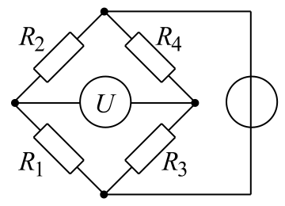

# Einleitung

# Theoretische Grundlagen

## Elektrotechnik
### Schwingkreise
Ein *$LC$-Schwingkreis* besteht aus einem Kondensator $C$ und einer Spule $L$, die kurzgeschlossen sind. Die Ladung des Kondensators wird über die Spule entladen und infolge der Selbstinduktion der Spule umgekehrt gepolt wieder aufgeladen. Wegen Leitungswiderständen klingt der Schwingkreis nach wenigen Perioden ab.

### Impedanz
Die elektrische *Impedanz* ist ein elektrischer Widerstand in der Wechselstromtechnik. Sie gibt bei einem zweipoligen Netzwerkelement das Verhältnis von elektrischer Spannung $U$ zur Stromstärke $I$ an.

Der Begriff wird insbesondere dann verwendet, wenn zwischen den beiden Größen eine Phasenverschiebung besteht, wodurch sich das Verhältnis vom Widerstand in Gleichstromanwendungen unterscheidet.

Die Impedanz einer Spule $S_L$ wird durch die Induktivität $L$ bestimmt, die Impedanz eines Kondensators $S_C$ durch die Kapazität $C$.

$$
\begin{eqnarray}
    Z_L &=& i\omega L \\
    Z_C &=& \frac{1}{i\omega C}
\end{eqnarray}
$$

Ein *Ohm'scher Widerstand* ist dagegen ein elektrischer Widerstand, der unabhängig von elektrischer Spannung $U$, Stromstärke $I$ und deren Frequenz $\nu$ ist. Das *Ohm'sche Gesetz* kann sowohl für Ohm'sche Widerstände $R$ als auch für Impedanzen $Z$ angewendet werden.

$$
\begin{eqnarray}
    U &=& R\cdot I \\
    U &=& Z\cdot I
\end{eqnarray}
$$

### Wheatstonebrücke
Eine *Wheatstonebrücke* wird verwendet, um die ohmschen und kapazitiven Anteile von Wechselstromwiderständen zu bestimmen.

Dabei werden zwei Wechselstromwiderstände, bestehend aus einem Ohm'schen Widerstand $R$ und einem Kondensator $C$, in Reihe geschaltet. Parallel dazu wird ein Widerstand geschaltet, der mit einem Schleifdraht geregelt werden kann. Dabei ist $R_1$ der Widerstand in der Masche mit den zu bestimmenden Widerständen $R_x$ und $C_x$, $R_2$ ist der Widerstand in der Masche mit bekannten Widerständen $R_0$ und $C_0$.

Durch das Oszilloskopsignal wird der Abgriff des Schleifdrahtes in die Mitte gebracht. Der Nullabgleich erfolgt dadurch, dass durch eine geeignete Wahl des Widerstandes $R_0$ und der Kapazität $C_0$ eines Kondensators das Signal am Oszilloskop auf ein Minimum gebracht wird. Der Feinabgleich erfolgt mit dem Schleifdraht.

Mithilfe der *Wheatstoneformel* kann ein unbekannter Widerstand $R_x$ aus drei bekannten Widerständen $R_i$ bestimmt werden.

$$
\begin{aligned}
    R_x I_A &= R_1 I_B \\
    R_0 I_A &= R_2 I_B \\
    \Rightarrow R_x &= \frac{R_0\cdot R_1}{R_2}
\end{aligned}
$$

# Durchführung

# Auswertung

# Fazit

# Literatur
1. Universität zu Köln, "B1.5: Elektronenspinresonanz", Februar 2009, Online verfügbar unter [https://teaching.astro.uni-koeln.de/sites/default/files/praktikum_b/Anleitung_1.5.pdf](https://teaching.astro.uni-koeln.de/sites/default/files/praktikum_b/Anleitung_1.5.pdf)
2. Wikimedia, [File:WhBr_Diagonalbild.svg](https://upload.wikimedia.org/wikipedia/commons/e/e3/WhBr_Diagonalbild.svg), Abruf am 23.05.2024
