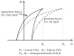
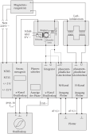
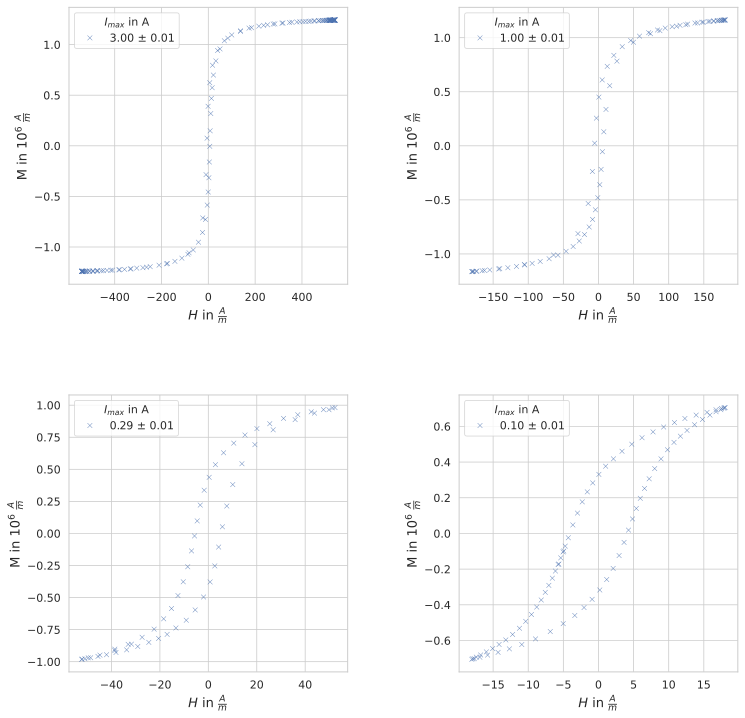
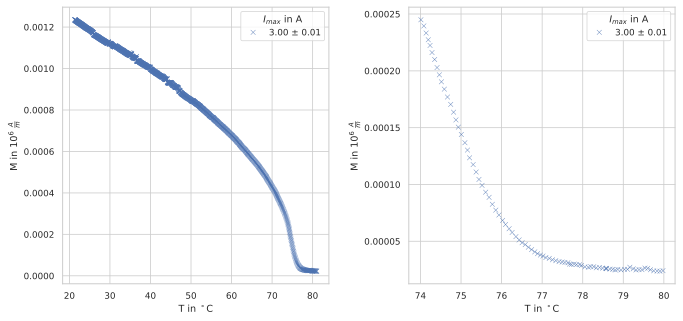
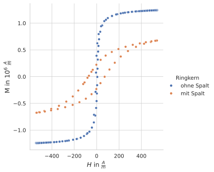

# Motivation
In diesem Versuch werden Ordnungsphänomene von ferromagnetischen Materialien  behandelt. Hierzu werden die Magnetisierungskurven an zwei verschiedenen Aufbauten aufgenommen. Deren zentraler Bestandteil ein Ringkern aus einem Ferrit-Werkstoff ist.

Anhand dieser Kurven lassen sich zahlreiche Eigenschaften dieses Ringkerns untersuchen, wie zum Beispiel die Suszeptibilität, das Temperatur- und das Entmagnetisierungsverhalten.

Mithilfe dieses Versuchs kann ein Einblick in Phänomene des Magnetismus erlangt werden. Dessen Wirkung beschäftigt Menschen schon seit hunderten von Jahren und welcher Grundlage für zahlreiche technische Anwendungen ist.

# Theoretische Grundlagen
## Grundlagen des Magnetismus
Das Phänomen des Magnetismus kann nicht klassisch erklärt werden, sondern muss durch die Quantenmechanik beschrieben werden. Sie befasst sich mit Strömen, was sie qualitativ von der Elektrostatik unterscheidet.

Die wichtigsten Größen sind die *Flussdichte* $\vec B$, die *Magnetisierung* $\vec M$ und die *Feldstärke* $\vec H$. Diese werden durch die *Feldkonstante* $\mu_0=4\pi\cdot\pu{10^{-7}\frac{Vs}{Am}}$ bzw. die *Permeabilität* $\mu$ miteinander in Verbindung gebracht. Die Permeabilität beschreibt die Durchlässigkeit für magnetische Felder. $[2]$

$$
\begin{eqnarray}
    \vec B
        &=& \mu_0 \cdot \left(\vec H + \vec M\right) \tag{M1} \\
        &=& \mu \cdot \vec H
\end{eqnarray}
$$

Die *Suszeptibilität* $\chi$ ist eine dimensionslose Größe, welche die Magnetisierbarkeit von Materie beschreibt. Sie beschreibt die Änderung der Magnetisierung $\vec M$ durch die Änderung der Feldstärke $\vec H$.

$$
\begin{eqnarray}
    \chi &=& \frac{\mathrm dM}{\mathrm dH} \tag{Chi}
\end{eqnarray}
$$

Das magnetische Dipolmoment $\vec \mu$ tritt auf, wenn elektrische Ladungen sich auf Kreisbahnen bewegen. Es lässt sich über das auf einen magnetischen Dipol wirkende Drehmoment $\vec \tau$ in einem Magnetfeld $\vec B$ definieren.

Für eine ebene Leiterschleife ist es folgendermaßen beschrieben. $[2]$ Die Dichte des magnetischen Momentes wird durch die Magnetisierung beschrieben.

$$
\begin{eqnarray}
    \vec \tau &=& \vec \mu \times \vec B \\
    \vec M &=& \frac{\vec \mu}{V}
\end{eqnarray}
$$

Das Magnetfeld im Inneren einer Spule kann durch den Strom $I$, die Windungszahl $n$ und die Länge der Spule $l$ beschrieben werden. Dabei ist $\vec e_z$ der Einheitsvektor längs der Spule, d.h. senkrecht zur Querschnittsfläche derselben. $[2]$

$$
\begin{eqnarray}
    \vec H &=& \frac{In}{l} \vec e_z \tag{H(I)}
\end{eqnarray}
$$

Für eine einzelne Leiterschleife ist das Magnetfeld dagegen durch die eingeschlossene Fläche $A$ zu beschreiben, sowie durch den Einheitsvektor $\vec e_A$ senkrecht zu $A$.

$$
\begin{eqnarray}
    \vec H &=& IA \vec e_A
\end{eqnarray}
$$

## Magnetismus ohne Ordnungsphänomene
### Bahnmagnetismus und Spinmagnetismus
Der Bahnmagnetismus beschreibt das magnetische Moment $\vec m_l$ eines Teilchens aufgrund seiner Bahnbewegung durch den Bahndrehimpuls. Analog gibt es Spinmagnetismus, dieser beschreibt das magnetische Moment eines Teilchens aufgrund seines Spins.

Besitzt ein Teilchen sowohl ein Bahndrehimpuls $\vec L$ als auch einen Spin $\vec S$, so lässt sich das gesamte magnetische Moment $\vec{m}$ dieses Teilchens ausdrücken als:

$$
\begin{eqnarray}
    \vec m &=& \vec m_l + \vec m_s
\end{eqnarray}
$$

Alternativ sind das magnetische Moment $\vec{m}$ und der Gesamtdrehimpuls $\vec{J}$ über das gyromagnetische Verhältnis $\gamma$ miteinander verknüpft.

### gyromagnetisches Verhältnis
Das magnetische Moment $\vec{m}$ und der Gesamtdrehimpuls $\vec{J}$ sind über das gyromagnetische Verhältnis $\gamma$ miteinander verknüpft. $[6]$ Dabei wird $\gamma$ durch das Planck'sche Wirkungsquantum $\hbar$, das Bohr'sche Magneton $\mu_{B}$ und den Lande-Faktor $g$ bestimmt.

$$
\begin{eqnarray}
    \gamma &=& \frac{g\mu_B}{\hbar} \\
    \vec{m} &=& \gamma \vec{J}
\end{eqnarray}
$$

Besitzt ein Teilchen sowohl ein Bahndrehimpuls $\vec L$ als auch einen Spin $\vec S$, so lässt sich das gesamte magnetische Moment $\vec{m}$ durch Bahnmagnetismus und Spinmagnetismus darstellen.

$$
\begin{eqnarray}
    \vec m &=& \vec m_l + \vec m_s
\end{eqnarray}
$$

<!-- [[@Gross2012Festkörper|Gross, Festkörperphysik]], S. 761 -->

### Lande-Faktor
Der Lande-Faktor $g$ bestimmt das gyromagnetische Verhältnis $\gamma$.

Für ein Elektron ist der Lande-Faktor $g$ durch den Gesamtdrehimpuls $J$, den Spin $S$ und den Bahndrehimpuls $L$ bestimmt. $[6]$ Im Falle reinen Spinmagnetismus gilt $g_{s} \approx 2$, ebenso bei reinem Bahnmagnetismus.

$$
\begin{eqnarray}
    g &=& 1 + \frac{J(J+1) + S(S+1) + L(L+1)}{2J(J+1)}
\end{eqnarray}
$$

Die einzelnen Terme, z.B. $J(J+1)$, sind proportional zu dem Erwartungswert der quadrierten Drehimpulsoperatoren, in diesem Beispiel $\hat J^2$.

<!-- [[@Gross2012Festkörper|Gross, Festkörperphysik]], S. 1044 -->

### Bohr'sches Magneton
Das Bohr'sche Magneton $\mu_B$ beschreibt das magnetische Moment, das ein Elektron durch seine Rotation um den Atomkern erzeugt. Seine Einheit ist Energie pro Tesla.

$$
\begin{eqnarray}
    \mu_B &=& \frac{e\hbar}{2m_e} \\
    \mu_B &\approx& \pu{5.788 \cdot 10^{-5} \frac{eV}{T}} \\
    \mu_B &\approx& \pu{9.274 \cdot 10^{-24} \frac{J}{T}}
\end{eqnarray}
$$

### Diamagnetismus
Ein diamagnetischer Festkörper besitzt keine inneren magnetischen Momente. Durch ein äußeres Magnetfeld werden aber magnetische Momente im Festkörper induziert. Diese sind aufgrund der Lenz'schen Regel dem induzierenden Magnetfeld entgegengesetzt, weshalb die magnetische Suszeptibilität von diamagnetischen Festkörpern $\mu_\mathrm{dia}$ negativ ist.

Für Isolatoren ist $\mu_\mathrm{dia}$ außerdem von der Temperatur des Isolators unabhängig.

Perfekter Diamagnetismus ist bei Supraleitern zu finden. Diese weisen eine magnetische Suszeptibilität von $\chi_\mathrm{supra} = -1$ auf.

Deshalb wird sich ein beweglicher Diamagnet in einem inhomogenen Magnetfeld aus diesem herausbewegen, was einen Unterschied zu Paramagneten darstellt.

Ein diamagnetischer Festkörper besitzt keine inneren magnetischen Momente. Durch ein äußeres Magnetfeld werden aber magnetische Momente im Festkörper induziert. Diese sind aufgrund der Lenz'schen Regel dem induzierenden Magnetfeld entgegengesetzt, weshalb die magnetische Suszeptibilität von diamagnetischen Festkörpern $\mu_\mathrm{dia}$ negativ ist. $[6]$

Für Isolatoren ist $\mu_\mathrm{dia}$ außerdem unabhängig von der Temperatur des Isolators. $[6]$

Perfekter Diamagnetismus ist bei Supraleitern zu finden. Diese weisen eine magnetische Suszeptibilität von $\chi_\mathrm{supra} = -1$ auf.

<!-- [[@Gross2012Festkörper|Gross, Festkörperphysik]], S. 671-->
<!-- [[@Gross2012Festkörper|Gross, Festkörperphysik]], S. 679-->

### Paramagnetismus
In einem paramagnetischen Festkörper liegen innere magnetische Dipolmomente vor, welche z.B. durch Spin und Bahndrehimpuls der Elektronen herrühren. Diese wechselwirken allerdings nicht miteinander, wodurch sie nur in einem äußeren Magnetfeld in Richtung des Feldes ausgerichtet werden. Die magnetische Suszeptibilität $\chi_\mathrm{para}$ eines paramagnetischen Festkörpers ist daher positiv.

#### Langevin-Paramagnetismus
Der Langevin-Paramagnetismus liefert Beschreibungen für paramagnetische Isolatoren. Die magnetische Suszeptibilität $\chi_\mathrm{langevin}$ dieser ist durch das Curie-Gesetz durch die Curie-Konstante $C$ und die Temperatur $T$ beschrieben. $[6]$

$$
\begin{eqnarray}
    \chi_\mathrm{langevin} &=& \frac{C}{T}
\end{eqnarray}
$$

<!-- [[@Gross2012Festkörper|Gross, Festkörperphysik]], S. 688-->

#### Pauli-Paramagnetismus
Der Pauli-Paramagnetismus beschreibt die Eigenschaften von paramagnetischen Metallen. Die magnetische Suszeptibilität $\chi_\mathrm{pauli}$ eines solchen Metalle ist konstant. $[6]$

$$
\begin{eqnarray}
    \chi_\mathrm{pauli} &=& \mathrm{const}
\end{eqnarray}
$$

Hier tritt keine Temperaturabhängigkeit mehr auf, da aufgrund der Fermi-Statistik nur grob $\frac{T}{T_F}$ Elektronen in einem Energieintervall um die Fermi-Energie ihre Energie ändern können, wobei $T_{f}$ die Fermi-Temperatur ist. Dadurch stellt sich ein temperaturunabhängiger Beitrag $\frac{C}{T} \frac{T}{T_F} = \frac{C}{T_F}$ ein. $[6]$

Der Pauli-Paramagnetismus ist deutlich schwächer als der Langevin-Paramagnetismus.

$$
\begin{eqnarray}
    \frac{\chi_\mathrm{pauli}}{\chi_\mathrm{langevin}}
        &\propto& \frac{T}{T_F} \ll 1
\end{eqnarray}
$$

<!-- [[@Gross2012Festkörper|Gross, Festkörperphysik]], S. 695-698-->

## Magnetismus mit Ordnungsphänomen
### magnetische Ordnung
Die magnetische Ordnung wird durch die Austauschwechselwirkung verursacht. Diese beruht auf dem Pauli-Prinzip.

### magnetische Anisotropie
Anisotropie ist die Eigenschaft eines Material, die von der Ausrichtung der magnetischen Drehmomenten abhängt. Dabei bezeichnet man die energetisch günstigere Ausrichtung als *Achse leichter Magnetisierung*. Die Kristallstruktur bestimmt über die Art der Anisotropie. Man unterscheidet zwischen Formanisotropie, Spannungsanisotropie und Kristallanisotropie.

Im Allgemeinen ist Anisotropie die Richtungsabhängigkeit einer Eigenschaft oder eines Vorgangs.

### Ferromagnetismus
Bei Ferromagnetismus richten sich die magnetische Momente parallel zueinander aus. Im *ferrimagnetischen* Material dagegen sind die Momente abwechselnd antiparallel zueinander ausgerichtet, dennoch heben sich die Beträge sich nicht auf wie in einem *antiferromagnetischen* Material.

### Domänen / Weiß'sche Bezirke
Weiß'sche Bezirke sind Bereiche mit gleichartige Magnetisierungsausrichrung. Der Grenzbereich zwischen zwei Weißschen Bezirke nennt man *Bloch-Wand*. Auch wenn kein äußeres Magnetfeld angelegt ist, existieren vereinzelte Bereiche mit parallelen Spins, die man *Domänen* nennt.

Legt man nun ein Magnetfeld an, verschmelzen kleine Domänen zu größeren und die Magnetisierung der Stoffes ist messbar. Bei kleiner Feldstärke findet reversible *Wandverschiebungen* statt.

Schaltet man die Feldstärke hoch finden sogenannte *Barkhausen-Sprünge* statt. Hierbei ändert sich die Ausrichtung alle magnetischen Momente ganzer Weiß'scher Bezirke schlagartig, so dass es zu einer deutlichen Änderung in der Magnetisierungskurve kommt. Dies geschieht, wenn Defekte in Kristallen zunächst nicht von der Verschiebung der Bloch-Wände betroffen sind. Sind sie fast umringt, so schließt sich die Domäne um den Defekt, wodurch die Magnetisierung sprunghaft ansteigt.

Kurz vor der Sättigung finden *Rotationsprozesse* statt, wo dann alle magnetische Momente in Richtung des äußeren Feldes zeigen.

### Hysteresekurve
Die Hysteresekurve beschreibt das Verhalten eines Materials im äußeren Magnetfeld.

Die Kurve startet im Ursprung und steigt (durch *Wandverschiebungen*) leicht an, dreht man das Feld auf wird die Kurve wegen der *Barkhausen-Sprünge* steiler. Bei größer werdenden Feldstärken verläuft sie durch die Rotation wieder flacher zu. Dann findet die *Sättigung* statt, wo die maximale Magnetisierung erreicht ist. Diese Kurve bezeichnet man als *Neukurve*.

Entfernt man das Magnetfeld bzw. schaltet man es ab, sinkt die Magnetisierung nicht automatisch auf null, sondern eine Restmagnetisierung bleibt übrig, sogenanntes *Remanenz*.

Sollt auch diese verschwinden, muss man ein negatives Feld anlegen und die *Koerzitivfeldstärke* erreichen, der Stoff ist dann vollständig entmagnetisiert. Wird die Feldstärke weiter erhöht, magnetisiert der Stoff in die entgegengesetzte Richtung, bis die Sättigung wieder auftritt.

Die *Kommutierungskurve* ist die Verbindungskurve der Hystereseschleifen-Umkehrpunkte. Die Fläche, die die Hysteresekurve umschließt, entspricht dem Energiegehalt, das erbracht werden muss, messbar als Wärme.

Anhand der Hysterese kann man erkennen ob eine Probe weichmagnetisch oder hartmagnetisch ist. *Weichmagnetische* Materialien haben eine kleine Koerzitivfeldstärke und eine hohe Sättigungsmagnetisierung, sie sind also leicht zu magnetisieren. Man verwendet diese oft für Transformatoren und Sensoren.

*Hartmagnetische* Materialien dagegen haben eine große Koerzitivfeldstärke und einen niedrigen Sättigungspunkt. Sie sind schwer zu magnetisieren, daher baut man daraus oft Dauermagnete.

### Temperaturabhängigkeit
Magnetische Eigenschaften hängen von der Temperatur ab. Steigt diese, dann nimmt die Permeabilität ab, also die Ordnung der magnetische Momente. Durch Erhöhung der Temperatur fügt man dem System Energie zu und die Austauschwechselwirkung wird dadurch schwächer, bis sie irgendwann komplett überwunden wird. Dieser Punkt nennt man *Curie-Temperatur*, nur unter diese ist ein ferromagnetischer Stoff einsetzbar. Ab der Curie-Temperatur zeigt der Stoff paramagnetische Verhalten.

### Phasenübergänge
*Ordnungsparameter* beschreibt den Zustand eines System beim *Phasenübergang*.

Bei Ferromagneten ist der Parameter die Magnetisierung. Beträgt der Parameter Null, so ist das System völlig ungeordnet. Verläuft ein Phasenübergang sprunghaft (z.B. vom Wasser zu Eis), klassifiziert man ihn als *Übergang 1. Ordnung*. Ist der Verlauf kontinuierlich (z.B. von ferromagnetisch zu paramagnetisch) spricht man von einem *Übergang 2. Ordnung*.

Hierbei sind sprunghaft und kontinuierlich wie folgt definiert. Die 1. partielle Ableitung der Enthalpie $G(T,p)$ nach der Temperatur $T$ ist unstetig bzw. stetig.

*Latente Wärme* ist die Wärme, die dazu führt, dass ein Stoff seinen Aggregatzustand ändert, sie führt deshalb nicht zu einer Temperaturerhöhung.

## Entmagnetisierung
Laufen die Feldlinien eines äußeren magnetischen Feldes durch die Flächen eines Kristalls, so induzieren sie magnetische Dipolmomente im Kristall. Diesen kann man einen magnetischen Nordpol und einen magnetischen Südpol zuweisen.

Nach der Lenz'schen Regel wirkt das auf diese Weise induzierte Magnetfeld dem äußeren Feld entgegen. Dadurch wird das äußere Feld abgeschwächt, daher nennt man das induzierte Feld auch *Entmagnetisierungsfeld*.

### Entmagnetisierungsfaktor
Um einen Stoff mit der Magnetisierung $M$ zu entmagnetisieren, muss ein Entmagnetisierungsfeld $H_\mathrm{ent}$ angelegt werden. Der Entmagnetisierungsfaktor $N$ ist der Proportionalitätsfaktor, der den Zusammenhang zwischen dem Entmagnetisierungsfeldes $H_\mathrm{ent}$ und der Magnetisierung $M$ eines Materials beschreibt.

$$
\begin{eqnarray}
    N &\equiv& \frac{H_\mathrm{ent}}{M} \tag{defN}
\end{eqnarray}
$$

Um die Entmagnetisierung zu erreichen, ohne die interne Magnetisierung $M$ zu verändern, muss das magnetische Feld $H_E$ aus dem Medium in Luft verdrängt werden. Dazu kann ein Luftspalt im Medium erzeugt werden. Das Magnetfeld $H_L$ im Luftspalt wird um den Betrag erhöht, um den das Feld $H_E$ im Medium verringert wird.

$$
\begin{eqnarray}
    N &=& \frac{l_L}{l} \tag{N}
\end{eqnarray}
$$

Dies lässt sich mit einem Ringkern besonders gut realisieren.

### Herleitung des Entmagnetisierungsfaktors
Betrachtet werde ein Ringkern mit dem Ringradius $R$ und dem Ringquerschnitt mit Radius $r$ und Fläche $F_E$. Dieser Ringkern bestehe aus zwei Hälften, die durch einen Luftspalt der Länge $l_L$ und der Querschnittsfläche $F_L$. Die mittlere Länge des Rings $l_E$ sei sehr viel größer als $l_L$. Weiterhin sei $R$ sehr viel größer als $2r$, sodass das Magnetfeld im Ringkern als homogen angenommen werden kann. Auch sei $l_L$ klein, sodass auch das Magnetfeld im Spalt als homogen angenommen werden kann und der Streufluss vernachlässigbar ist.

Die Spule werde von einer zeitlich konstanten Stromdichte durchflossen. Dadurch lässt sich die Maxwell-Gleichung vereinfachen.

$$
\begin{eqnarray}
    \vec \nabla \times \vec H &=& \vec j
\end{eqnarray}
$$

Mithilfe des Satzes von Stokes können die Feldstärken mit Luftspalt und ohne Luftspalt verglichen werden. Dabei sei $H$ die Feldstärke ohne Luftspalt.

$$
\begin{eqnarray}
    H &=& H_E\cdot l_E + H_L \cdot l_L \tag{EF1}
\end{eqnarray}
$$

Weil Magnetfelder divergenzfrei ist, müssen die homogenen Felder eine Verbindung zwischen Luftspalt und Ringkern herstellen. Die Anschlussbedingungen fordern folgende Gleichheit. Weil der Streufluss vernachlässigbar sein soll, gilt $F_E = F_L$, wodurch Gleichheit der Feldstärken folgt.

$$
\begin{eqnarray}
    F_E\cdot B_E &=& F_L\cdot B_L \nonumber \\
    F_E = F_L \Rightarrow B_E &=& B_L \tag{EF2}
\end{eqnarray}
$$

Luft wird nicht magnetisiert $(M_L=0)$, der Ringkern dagegen schon $(M_E=M)$. Damit kann man die Materialbeziehungen $(\text{M1})$ in die obige Gleicheitsrelation $(\text{EF2})$ ein erhält man folgende Relation.

$$
\begin{eqnarray}
    B_E &=& \mu_0 \cdot \left(H_E + M\right) \nonumber \\
    B_L &=& \mu_0 \cdot H_L \nonumber \\
    \Rightarrow H_E + M &=& H_L \tag{EF3}
\end{eqnarray}
$$

Durch Einsetzen in $(\text{EF1})$ kann man die Feldstärken $H_E$ und $H_L$ durch $H$ und $M$ darstellen.

$$
\begin{eqnarray}
    \Rightarrow H_E &=& H - \frac{l_L}{l_E+l_L} M \\
    \Rightarrow H_L &=& H + \frac{l_E}{l_E+l_L} M
\end{eqnarray}
$$

Man sieht, dass die Feldstärke aus dem Ring in den Spalt verdrängt wird, die gesamte Feldstärke bleibt aber erhalten. Die Feldstärke $H_E$ im Ring wird verringert, der Ring wird also entmagnetisiert.

Da die Magnetisierung $M$ des Kerns im Versuch konstant bleibt, kann nur $H$ geändert werden, um $H_E$ auf $\pu{0T}$ zu reduzieren. Daher muss das Entmagnetisierungsfeld $H_\mathrm{ent}$ angelegt werden, um $H_E$ zu verringern. Dadurch kann man den Entmagnetisierungsfaktor $N$ durch seine Definition $(\text{defN})$ bestimmen.

$$
\begin{eqnarray}
    H_\mathrm{ent} &=& \frac{l_L}{l_E+l_L} M \\
    N &=& \frac{l_L}{l_E+l_L} = \frac{l_L}{l}
\end{eqnarray}
$$

### gescherte Hysteresekurve
Das äußere Magnetfeld $H$ wird über die Stromstärke gemessen, die Magnetisierung $M$ des Ringkerns wird konstant gehalten. Das Magnetfeld $H$ muss um ein Entmagnetisierungsfeld $H_\mathrm{ent}$ erhöht werden, um das innere Magnetfeld $H_E$ des Kerns zu negieren. Die benötigte Stärke von $H_\mathrm{ent}$ hängt von der Breite des Luftspalts ab, was aus dem Entmagnetisierungsfaktor hervorgeht, siehe Gleichung $(\text{N})$.

In einem Ringkern ohne Luftspalt entspricht die Stärke des äußeren Magnetfeldes $H$ der des inneren Magnetfeldes $H_E$. Mit einem Luftspalt steigt $H$ an, somit wird die Hystereseschleife nach außen geschert. Daher lässt sich $H_\mathrm{ent}$ durch die Scherung der Hystereseschleife bestimmen.

$$
\begin{eqnarray}
    H_\mathrm{ent} &=& H - H_E \tag{Hscher}
\end{eqnarray}
$$

### scheinbare Suszeptibilität
Bei konstanter Magnetisierung $M$ kann die Suszeptibilität $\chi$ als Quotient $\chi = \frac{M}{H}$ beschrieben werden, wobei $H$ der Betrag der Feldstärke zur Sättigungsmagnetisierung $M$ ist.

Falls ein Luftspalt im Medium vorliegt, müssen die effektive Feldstärke $H_E$ im Kern und die Feldstärke $H_L$ um Luftspalt betrachtet werden. Daher gibt es eine *scheinbare Suszeptibilität* $\chi_\mathrm{Schein}$ und eine *wahre Suszeptibilität* $\chi_\mathrm{wahr}$. Nur die wahre Suszeptibilität $\chi_\mathrm{wahr}$ wirkt auf das effektiv wirkende Feld $H_E$.

$$
\begin{eqnarray}
    \chi_\mathrm{Schein} &=& \frac{M}{H} \\
    \chi_\mathrm{wahr} &=& \frac{M}{H_E}
\end{eqnarray}
$$

Mit diesen Relationen kann man die wahre Suszeptibilität ermitteln.

$$
\begin{eqnarray}
    (\text{defN}) \Leftrightarrow H_\mathrm{ext} &=& NM
        \nonumber \\
        &=& HN\chi_\mathrm{Schein}
        \nonumber \\
    (\text{Hscher}) \Leftrightarrow H_E &=& H - H_\mathrm{ext}
        \nonumber \\
        &=& H - HN\chi_\mathrm{Schein}
        \nonumber \\
    \chi_\mathrm{wahr}
        &=& \frac{\chi_\mathrm{Schein} H}{H_E}
        \nonumber \\
        &=& \frac{\chi_\mathrm{Schein} H}{H - H_\mathrm{text}}
        \nonumber \\
        &=& \frac{\chi_\mathrm{Schein} H}{H - HN\chi_\mathrm{Schein}}
        \nonumber \\
    \chi_\mathrm{wahr}
        &=& \frac{\chi_\mathrm{Schein}}{1 - N\cdot\chi_\mathrm{Schein}} \tag{ChiWahr}
\end{eqnarray}
$$

# Durchführung
## Versuchsaufbau

## Messung am beheizbaren Ringkern
### Kenngrößenbestimmung
### Kommutierungskurve
#### Suszeptibilität
### Temperaturabhängigkeit der Magnetisierung
Am Phasenübergang ändert sich die Abhängigkeit qualitativ. Daher liegt die Curie-Temperatur an der Stelle, an der die Messkurve einen Knick hat.
## Messung am Ringkern mit Spalt
### Kenngrößenbestimmung
### Entmagnetisierungsfaktor

# Auswertung
## Messungen am beheizbaren Ringkern
### Kenngrößen
> Zur Auswertung: Bestimmen Sie aus allen 4 Kurven Remanenz, Koerzitivfeldstärke und maximale Magnetisierung. Fassen Sie diese Werte in einer Tabelle zusammen und diskutieren Sie diese. Entsprechen die Ergebnisse Ihren Erwartungen?

Zunächst müssen die gemessenen Werte in die richtigen Einheiten konvertiert werden. Gemessen wurden Spannungen, diese müssen in die Magnetisierung $M$ bzw. die magnetische Feldstärke $H$ umgerechnet werden.

Die Umrechnung in die Feldstärke kann mittels der Relation $(\mathrm{H(I)})$ erfolgen. Der Strom $I$ kann über das Ohm'sche Gesetz $U=RI$ aus der Spannung $U$ und dem Widerstand $R$ ermittelt werden. Da der Widerstand konstant ist, kann er durch das Verhältnis der maximalen Stromstärke $I_\mathrm{max}$ und der maximalen Spannung $U_\mathrm{max}$ beschrieben werden. Weiterhin wird die Länge $l$ der Spule benötigt. Diese entspricht dem Umfang des Ringkerns, also $l=2\pi r$ für einen Kern mit dem Radius $r$. Damit kann die Feldstärke $H$ wie folgt ermittelt werden.

$$
\begin{eqnarray}
	H &=&
		\frac{n_p}{2\pi r} \cdot \frac{I_\mathrm{max}}{U_\mathrm{max}} \cdot U
		\tag{H}
\end{eqnarray}
$$

Aus der Versuchsanleitung $[8]$ folgt, dass die Magnetisierung $M$ aus der gemessenen Spannung $U$ ermittelt werden kann. Hierbei sind $\nu=\pu{50 Hz}$ die Frequenz des Wechselstroms, $n_s$ die Windungszahl der Sekundärspule und $q = \pu{0.9 cm^2}$ die Querschnittsfläche des Kerns.

$$
\begin{eqnarray}
	M &=&
		\frac{U}{47\cdot 4\nu n_s q \mu_0}
		\tag{M}
\end{eqnarray}
$$

Die entsprechenden Messergebnisse werden in Abbildung $[3.3.1a]$ dargestellt. Es ergeben sich folgende Kenngrößen, die aus den Daten abgelesen werden können. Als Fehler werden hierbei die Differenzen der beiden Messwerte auf beiden Seiten der Kurve verwendet.

$$
\begin{align*}
	I_\mathrm{max} &\text{ in } A &
		\text{Remanenz } &\text{ in }
			{\tiny \left[ \frac{A}{m} \right] } &
		H_\mathrm{K} &\text{ in }
			{\tiny \left[ \frac{A}{m} \right] } &
		M_\mathrm{max} &\text{ in }
			{\tiny \left[10^6 \frac{A}{m} \right] }
		\\
	3.00 &\pm 0.01 &
		423.51 &\pm 20.42 &
		6.58 &\pm 2.27 &
		1243.66 &\pm 18.67
		\\
	1.00 &\pm 0.01 &
		401.68 &\pm 110.22 &
		6.25 &\pm 2.03 &
		1163.9 &\pm 18.87
		\\
	0.29 &\pm 0.01 &
		431.55 &\pm 60.85 &
		5.51 &\pm 1.64 &
		981.29 &\pm 24.64
		\\
	0.10 &\pm 0.01 &
		303.9 &\pm 42.27 &
		4.95 &\pm 1.30 &
		705.29 &\pm 26.18
		\\
\end{align*}
$$

Man sieht, dass die Remanenz und die maximale Magnetisierung mit steigender Stromstärke $I_\mathrm{max}$ zunehmen, was den Erwartungen entspricht. Selbiges gilt für die Koerzitivfeldstärke $H_\mathrm{K}$, wenngleich diese im Rahmen der Ungenauigkeit nahezu konstant bleibt.

### Kommutierungskurve und Suszeptibilität
> Zur Auswertung: Ermitteln Sie aus den Kommutierungskurven die differentielle Suszeptibilität und zeichnen Sie die Werte von $\chi_\mathrm{diff}$ in ein gemeinsames Diagramm. Aufgrund des Rauschens im Signal ist es sehr empfehlenswert, zunächst die Daten mit einer sinnvollen Funktion zu fitten und dann die Ableitung dieses Fits zu bestimmen. Sie können aber natürlich auch die Messdaten direkt numerisch ableiten. Diskutieren Sie den Verlauf der differentiellen Suszeptibilität.

### Temperaturabhängigkeit
Die Magnetisierung $M(T)$ ist wie erwartet eine abfallende Kurve. Bei der Curie-Temperatur $T_C$ findet ein Phasenübergang statt, bei dem das Material praktisch paramagnetisch wird. Daher kann man $T_C$ am unteren Knick ablesen.

$$
\begin{eqnarray*}
	T_C &=& (76.5 \pm 0.5) \ ^\circ\mathrm C
\end{eqnarray*}
$$

## Messungen am Ringkern mit Spalt
### Kenngrößen
> Bestimmen Sie Remanenz, Koerzitivfeldstärke und maximale Magnetisierung und vergleichen Sie diese mit der 3A-Kurve des beheizbaren Ferritkerns.

Analog zu den Messungen am beheizbaren Ringkern ohne Spalt können die Kenngrößen des Ringkerns mit Spalt ermittelt werden.

$$
\begin{align*}
	I_\mathrm{max} &\text{ in } A &
		\text{Remanenz } &\text{ in }
			{\tiny \left[ \frac{A}{m} \right] } &
		H_\mathrm{K} &\text{ in }
			{\tiny \left[ \frac{A}{m} \right] } &
		M_\mathrm{max} &\text{ in }
			{\tiny \left[10^6 \frac{A}{m} \right] }
		\\
	\text{ohne Spalt}\qquad
		3.00 &\pm 0.01 &
		423.51 &\pm 20.42 &
		6.58 &\pm 2.27 &
		1243.66 &\pm 18.67
		\\
	\text{mit Spalt}\qquad
		0.94 &\pm 0.01 &
		198.95 &\pm 49.8 &
		227.94 &\pm 24.80 &
		675.28 &\pm 14.92 &
\end{align*}
$$

Die Stromstärken $I_\mathrm{max}$ sind so gewählt, dass die erzeugte Feldstärke in beiden Kernen gleich groß ist. Damit lassen sich die Materialeigenschaften vergleichen.

Dabei fällt auf, dass Remanenz und maximale Magnetisierung bei dem Kern mit Spalt nur etwa halb so groß wie beim Kern ohne Spalt ist. Dafür ist die Koerzitivfeldstärke beim Kern mit Spalt um einen Faktor $38$ größer.

### Entmagnetisierungsfaktor
> Bestimmen Sie aus den gescherten Hysteresekurven den Entmagnetisierungsfaktor als Funktion der Spaltbreite und zeichnen Sie diesen gemeinsam mit der theoretischen Kurve in **ein** Diagramm. Diskutieren Sie die Abweichungen.
# Fazit
# Literaturverzeichnis
1. C. Kittel, Einführung in die Festkörperphysik, München: Oldenbourg Verlag, 2005
2. J. D. Jackson, Classical Elektrodynamics, New York: John Wiley & Sons , 1962
3. E. Kneller, Ferromagnetismus, Berlin Heidelberg: Springer Verlag, 1962
4. W. Reith, Bergmann-Schaefer. Lehrbuch der Experimentalphysik. Elektromagnetismus, Bd. 2, Berlin: Walter de Gruyter Verlag, 2006
5. S. Hunklinger, Festkörperphysik, München: Oldenbourg Verlag, 2011
6. R. Gross und A. Marx, Festkörperphysik, München: Oldenbourg Verlag, 2012
7. M. Fink, R.-D. Heuer und H. Kleinpoppen, Bergmann-Schaefer. Bestandteile der Materie, Bd. 4, W. Raith, Hrsg., Berlin: Walter de Gruyter Verlag, 2003
8. Universität zu Köln, "Anleitung zum Versuch 2.4 Magnetisierung eines Ferrits", Juni 2013, Online verfügbar unter [http://www.ph2.uni-koeln.de/fileadmin/Lehre/PraktikumB/B2.4.pdf](http://www.ph2.uni-koeln.de/fileadmin/Lehre/PraktikumB/B2.4.pdf)
