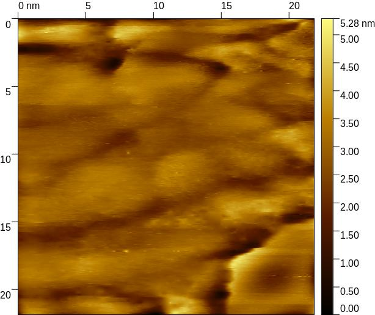

# Motivation
Mit einem Rastertunnelmikroskop[^1] (STM) können Oberflächenstrukturen in der Größe von Atomen gemessen werden, wenn die Oberfläche elektrischen Strom leitet.

In diesem Experiment werden zwei verschiedene Proben, eine aus Gold und eine aus Graphit, vermessen. Als die Graphitprobe wird hochorientiertes pyrolytisches Graphit (HOPG) verwendet, was eine besonders stabile Struktur aufweist.

[^1]: engl. Scanning Tunneling Microscope (STM)

# Theoretische Grundlagen
## Tunneleffekt
Quantenmechanische Teilchen können Potentialbarrieren auch dann überwinden, wenn ihre Energie eigentlich zu niedrig ist. Man spricht davon, dass sie durch die Barriere hindurchtunneln.

Die tatsächliche Potentialbarriere kann analog zur Gamow-Näherung als einzelne kastenförmiges Potential $V(z)$ angenommen werden. Die Potentialbarriere beginne an der Position $0$ bei der Probe und Ende an der Position $z_0$ an der Messspitze des STMs.

$$
\begin{eqnarray}
	V(z) &=&
		\begin{cases}
			V_0 &: z \in [0, z_0] \\
			0 &: z \notin [0, z_0]
		\end{cases}
\end{eqnarray}
$$
Die Lösung der eindimensionalen, stationären Schrödingergleichung liefert die Tunnelwahrscheinlichkeit $P(z_0)$, mit der das Teilchen die Barriere durchtunnelt. Der relevante Parameter $\kappa$ ist abhängig von der Elektronenmasse $m_e$, der Höhe der Potentialbarriere $V_0$ und der Energie $E$ des tunnelnden Elektrons. $\hbar$ ist die reduzierte Planck-Konstante.

$$
\begin{eqnarray}
	P(z_0) &\propto& |\Psi(0)|^2 \cdot \mathrm e^{-2\kappa z_0} \\
	\kappa &=& \frac{\sqrt{2m_e(V_0 - E)}}{\hbar} \tag{kappa} \\
\end{eqnarray}
$$
Diese Wahrscheinlichkeit ist exponentiell von der Breite des Potentials $z_0$ abhängig. Zudem ist sie von der Wahrscheinlichkeit für den Aufenthalt eines Teilchens am Beginn der Probe abhängig, die durch die quadrierte Wellenfunktion $|\Psi(0)|^2$.

Diese Wahrscheinlichkeit hängt davon ab, wie wahrscheinlich ein Elektron aus der Probe austritt. Dazu ist die Austrittsenergie $\phi$ essentiell. Dafür wiederum ist die Besetzung der Energieniveaus relevant, die von der Temperatur und der Fermi-Energie abhängt. Die Beschreibung erfolgt durch die Zustandsdichte.

Für das STM ist jedoch nicht der Einzelfall interessant, sondern die Rate, mit der Elektronen aus der Probe austreten und tunneln. Dies kann durch den *Tunnelstrom* $I$ beschrieben werden.

Der Tunnelstrom ist proportional zur Tunnelwahrscheinlichkeit $P(z_0)$, ebenso zu der Anzahl der Elektronen, die in einer gewissen Zeit aus dem Material austreten. Dadurch ist der Tunnelstrom exponentiell von der Breite $z_0$ der Potentialbarriere abhängig.

$$
\begin{eqnarray}
	I(z_0) &\propto& \mathrm e^{-2\kappa z_0} \tag{I(z)}
\end{eqnarray}
$$
Durch die exponentielle Abhängigkeit des Tunnelstroms $I$ von dem Abstand $z_0$ ist ein STM sehr sensibel gegen Höhenunterschieden. Schon ein Höhenunterschied von $1\,\mathrm{\mathring{A}}$ macht einen Faktor von näherungsweise $8$ im Tunnelstrom aus. $[2]$ Dadurch können Atomstrukturen an der Oberfläche gemessen werden.

## piezoelektrischer Effekt und Anwendung
Der piezoelektrische Effekt bezeichnet die Erzeugung elektrischer Spannungen an bestimmten Kristallen, den Piezokristallen, bei deren Deformation. Dies funktioniert auch umgekehrt: Durch Anlegen einer Spannung verformt sich ein Piezokristall. Dies nennt man *inversen Piezoeffekt*.

Der inverse Piezoeffekt wird zur Bewegung der Messspitze verwendet. Diese ist an einer Platform befestigt, die auf drei Piezoröhrchen steht. Durch Anlegen von Spannung an diesen Röhrchen verformen diese sich. Wird die Spannung langsam angelegt und plötzlich entfernt, so geschieht diese Verformung erst langsam, dann sprunghaft.

Wird die Spannung auf diese Weise bei allen drei Piezoröhrchen variiert, so wird die Position der Messspitze verändert. Hierbei gibt es die zwei Variationen: Entweder kann die Position auf der Probenoberfläche verändert werden, beispielsweise kann nach rechts "gewandert" werden. Alternativ kann die Messspitze rotiert werden, ohne die Position auf der Probenoberfläche zu verändern. Dies kann dazu genutzt werden, um die Höhe der Messspitze zu steuern.

## Gitterstruktur und Einheitszelle
Was ist eine Einheitszelle? Wie sehen Gitterstrukturen aus?

# Durchführung
## Gold
### Strukturmessung
Zunächst wird die grobe Struktur von Gold gemessen, dabei wird eine Stufenkante gesucht. Dies erweist sich als schwierig, da die Probe kontaminiert ist. Es entstehen keine scharfen Bilder, allerdings gibt es eine Stelle mit mehreren scharfen Kanten. Diese sehen jedoch nicht nach Gold aus, vermutlich wurde ein Fremdkörper vermessen.

Die Probe ist zerkratzt, dies ist mit dem bloßen Auge sichtbar. Andere Kontaminationen, u.a. biologischer Natur, werden explizit nicht ausgeschlossen.

### Austrittsarbeit
Zur Messung der Austrittsarbeit wird die Messspitze an der selben Position in der Höhe verändert, dabei wird der Tunnelstrom $I(z)$ gemessen. Im ersten Teil wird sie um $3\,\mathrm{\mathring{A}}$ abgesenkt und wieder angehoben, im zweiten Teil wird die Messspitze stattdessen um $3\,\mathrm{\mathring{A}}$ angehoben und wieder abgesenkt.

## Graphit
Wie bei der Goldprobe wird zunächst ein grobes Bild der Struktur gemessen. Dabei soll eine glatte Stelle gefunden werden, an der eine Detailaufnahme der Atomstruktur aufgenommen wird. Wie auch die Goldprobe ist auch diese Probe zerkratzt, was wieder mit bloßem Auge zu erkennen ist.

# Auswertung
Die Messergebnisse können mit der Software [Gwyddion](http://gwyddion.net) $[1]$ alternativ mit [WSxM](http://www.wsxm.eu) $[2]$ ausgewertet werden.

## Gold
Die im Versuch aufgenommenen Bilder von Gold sind alle sehr verschieden. Auf einigen ist das Rauschen zu groß und es sind amorphe Region zu sehen, deshalb werden sie nicht im Protokoll weiter diskutiert. Daher wurden uns vonseiten der Versuchsbetreung zusätzliche Daten zur Auswertung bereitgestellt. $[6]$

### eigene Messung

In Abbildung 1?? kann man mögliche Stufenkanten sehen. Das darunterliegende Gebiet ist nicht eindeutig zu identifizieren. Vermutlich erstrecken sich viele Stufenkanten über diesem Bild, was aber wegen Rauschen im Messsignal unklar ist.

Die gesamte Struktur sieht nicht nach einem Einkristall aus. Dies legt die Vermutung nahe, dass Fremdkörper auf der Probe sind.

Bei Abbildung 2?? erkennt man eine mögliche Terrassenstruktur, die von links nach rechts verlaufen. Auch hier leiden die Bilddetails unter der schlechten Qualität, scharfe Kanten sind nicht zu erkennen. Möglicherweise gibt es auch hier Fremdstoffe, die z.B. die Leitfähigkeit oder die Tunnelwahrscheinlichkeit beeinflussen.

Biologisches Material wie Fettspuren könnten diese Bilder erklären.

### bereitgestelltes Material

In Abbildung 3?? kann man eine Stufenkante in der Höhe von $1.03\mathrm{\,nm}$ in der oberen rechten Bildhälfte erkennen. Die Oberfläche scheint sehr glatt zu sein, wobei auch hier ein Rauschen im Bild auftritt.

Die Stufenkante entsteht bei der Abkühlung nach dem Ausglühen der Probe, d.h. durch die thermische Spannung. Gold besitzt eine $\mathrm{fcc}$-Gitterstruktur, so treten die Stufenversetzungen in den $\braket{111}$-Ebenen auf, die sind auch die dichtgepackten Ebenen sind. Die Stufenkante verläuft in die selbe Richtung wie der Burgersvektor, nämlich in die $\braket{110}$-Richtungen.

In Abbildung 4?? sind Terrassen abgebildet, die von Stufenkanten getrennt sind. Die Stufen verlaufen von unten rechts nach oben links und die Breite der einzelnen Stufen scheinen relativ gleichmäßig zu sein.

### Vergleich
Die von uns erstellten Messungen unterscheiden sich massiv von den bereitgestellten Messungen. Alle Messungen haben eine vergleichbare Bias-Spannung, die Stromstärken unterscheiden sich jedoch.

Insbesondere die bereitgestellte Messung der Stufenkante (Abb. 3??) ist bei einer deutlich geringeren Stromstärke als alle anderen Messungen an Gold vorgenommen worden, die Stromstärken unterscheiden sich um einen Faktor $6$ von unseren Stromstärken. Die Stromstärken von unseren Messungen sind jedoch auch um ca. $30\%$ größer als die bereitgestellte Messung der Terassen (Abb. 4??) bei $3.5 \mathrm{\,nA}$. Dies unterstützt die These, dass unsere Probe nicht sauber ist und eine Barriere aus Fremdstoffen die Tunnelwahrscheinlichkeit verringert.

### Austrittsarbeit
Die Austrittsarbeit $\phi$ ist die Differenz zwischen Potentialbarriere $V_0$ und der Energie $E$ der tunnelnden Elektronen. Mithilfe der Relationen für die Tunnelwahrscheinlichkeit $(\mathrm{kappa})$ und den Tunnelstrom $(I(z))$ kann man die Austrittsarbeit ermitteln.

$$
\begin{eqnarray}
	I(z) &\propto& \exp\left[-2\frac{\sqrt{2m_e\cdot \phi}}{\hbar} z\right] \\
	\ln(I(z))
		&=& \ln(c)
			+ \left(-2\frac{\sqrt{2m_e}}{\hbar}\right)
			\cdot \sqrt{\phi} \cdot z \\
	\ln(I(z)) &=& \ln(c) + 0.51 \mathrm{\,\frac{\sqrt{eV}}{\mathrm{\mathring{A}}}}\cdot \sqrt{\phi} \cdot z
\end{eqnarray}
$$
Im letzten Schritt wurden die Naturkonstanten passend eingesetzt. $[3]$ Dadurch kann die Austrittsarbeit aus der Steigung $m$ einer Regression von $\ln(I(z))$ ermittelt werden.

$$
\begin{eqnarray}
	\phi &=& \left(\frac{m}{0.51}\right)^2 \mathrm{\,eV}
\end{eqnarray}
$$

Dadurch ergeben sich folgende Ergebnisse, von denen die erste Hälfte aus der ersten Messung und die zweite Hälfte aus der zweiten Messung stammen.

| Steigung $m$ in $10^{-3} \mathrm{\mathring A}^{-1}$ | $\phi$ in $10^{-6}\mathrm{eV}$ |
| :-------------------------------------------------: | :----------------------------: |
|                  $10.549 \pm 0.049$                 |      $111.290 \pm 0.002$       |
|                  $16.579 \pm 0.079$                 |      $274.872 \pm 0.006$       |
|                  $16.464 \pm 0.078$                 |      $271.057 \pm 0.006$       |
|                  $15.579 \pm 0.065$                 |      $242.699 \pm 0.004$       |
|                  $17.176 \pm 0.054$                 |      $295.018 \pm 0.003$       |
|                  $12.439 \pm 0.048$                 |      $154.737 \pm 0.002$       |
|                  $10.123 \pm 0.038$                 |      $102.478 \pm 0.001$       |
|                  $13.417 \pm 0.043$                 |      $180.009 \pm 0.002$       |
|                  $13.945 \pm 0.038$                 |      $194.458 \pm 0.001$       |
|                  $13.526 \pm 0.057$                 |      $182.949 \pm 0.003$       |

# Fazit
# Literatur
1. Gwyddion, [http://gwyddion.net](http://gwyddion.net)
2. I. Horcas, R. Fernandez, J.M. Gomez-Rodriguez, J. Colchero, J. Gomez-Herrero and A. M. Baro, Rev. Sci. Instrum. 78, 013705 (2007), [http://www.wsxm.eu](http://www.wsxm.eu)
3. Universität zu Köln, "Versuch B.2.5. Rastertunnelmikroskopie", 31.03.2017, [https://ph2.uni-koeln.de/fileadmin/Lehre/PraktikumB/B2.5_Anleitung_2017_03.pdf](https://ph2.uni-koeln.de/fileadmin/Lehre/PraktikumB/B2.5_Anleitung_2017_03.pdf)
4. H. A. Mizes, W. A. Harrison und S.-i. Park, "Multiple-tip interpretation of anomalous scanning-tunneling-microscopy images of layered materials", Physical Review B Volume 36, pp. 4491 - 4494, 15. September 1987
5. H. J. Mamin, E. Ganz, D. W. Abraham, R. E. Thomson und J. Clarke, "Contamination- mediated deformation of graphite by the scanning tunneling microscope", Physical Review B Volume 34, 15. Dezember 1986
6. Versuchsbetreuung: M.Sc. Catherine Grover, Studentin der Festkörperphysik im PhD an der Universität zu Köln, [https://ph2.uni-koeln.de/en/research-groups/group-michely/members](https://ph2.uni-koeln.de/en/research-groups/group-michely/members)
