# B2.8 - Versetzungen in Lithiumfluorid
# Einleitung
Alle Kristalle haben Kristallbaufehler, die ihre Struktur beeinflussen. Punktuelle Kristallbaufehler sind für elektrische Eigenschaften relevant, lineare Kristallbaufehler wie Versetzungen für mechanische Eigenschaften wie Plastizität und die kritische Fließspannung. In diesem Versuch werden Versetzungen betrachtet.

In diesem Versuch werden Versetzungen an der Oberfläche von Lithiumfluorid-Kristallen mithilfe der Doppelätz-Methode sichtbar gemacht. Versetzungsbewegungen sind besonders in der Festkörper-Forschung interessant, da diese Wanderung eine plastische Verformung ist, aus der man Eigenschaften wie Plastizität und  des Kristall ableiten kann.

## Lithiumfluorid
Lithiumfluorid ($\mathrm{LiF}$) ist ein ionischer Kristall, das bedeutet, dass der Kristall durch elektrostatische Wechselwirkung entgegengesetzt geladener Ionen zusammengehalten wird. $\mathrm{LiF}$ hat eine sehr hohe Gitterenergie von $1034\mathrm{\,\frac{kJ}{mol}}$, was an den kleinen Ionenradien des Lithiumkations und des Fluoridanions liegt.

Daher ist es gut für unseren Versuch geeignet, weil Versetzungswanderungen bei großem Druck durch eine Presse auftreten, ohne dass die Gitterstruktur großflächig zerstört wird. Stattdessen gleitet nur ein Teil der Struktur.

Die Gitterstruktur von $\mathrm{LiF}$ entspricht der von Natriumchlorid mit einer flächenzentriert-kubischen Gitterstruktur und einer zweiatomigen Basis. Gitterkonstante von $\mathrm{LiF}$ beträgt $a=0.402\mathrm{\,nm}\pm 1 \cdot 10^{-7} \mathrm{\, \mu m}$. $[5]$

## Doppelätzmethode
Zur Messung von Versetzungsbewegungen wird in diesem Versuch die Doppelätzmethode angewandt. Sie besteht aus zwei Ätzdurchgängen, um eine erste Versetzung und anschließend eine Versetzungsbewegung verzeichnen zu können.

Versetzungen verschiedener Orientierung oder Typen behindern sich gegenseitig, die reduzierte Mobilität resultiert in einer Ansammlung von Versetzungshaufen. Diese Ansammlung staut sich an Korngrenzen auf.

Alte Versetzungsstellen sind deshalb daran zu erkennen, dass sie dichter und definierter sind. Die Bewegung wird durch die Messung des Abstand des letzten Versetzungspunktes nach der ersten Messung und der neuen Versetzungsstellen bestimmt.

Mithilfe der Bewegungsrichtung und Geschwindigkeit können die Gleitebene, das Gleitsystem und somit die Versetzungsart bestimmt werden.

# Theoretische Grundlagen
## kürzester Burgers-Vektor in $\mathrm{LiF}$
Der kürzeste Burgers-Vektor $\vec{b}_\mathrm{min}$ in $\mathrm{LiF}$ ist der $[\frac{1}{2}\,0\,\frac{1}{2}]$ Vektor in der $\braket{1\,1\,0}$ Richtung. Seine Länge bestimmt sich wie folgt. Hierbei ist $a=0.402\,\mathrm{nm}$ die Gitterkonstante von $\mathrm{LiF}$. $[5]$

$$
\begin{eqnarray}
	\left|\vec{b}_\mathrm{min}\right|
		&=& \frac{1}{2} \cdot \sqrt{a^2 + a^2} \\
		&=& \frac{1}{2} \sqrt{2} a \\
		&=& \frac{a}{\sqrt{2}}
\end{eqnarray}
$$

Die Energie einer Versetzung ist proportional zum Quadrat des Burgers-Vektors. Ein Defekt mit einem längeren Burgers-Vektor benötigt daher eine viel größeren Energie, was Versetzungen mit längeren Burgers-Vektoren sehr viel unwahrscheinlicher macht.

Aufgrund der sich abwechselnden Lithium- und Fluoratome in den Richtungen $\braket{1\,0\,0}$ und $\braket{1\,1\,1}$ sind die Burgers-Vektoren in diesen Richtungen doppelt so lang, da sie immer zwischen gleichen Atomen liegen. Der Burgers-Vektor in der $\braket{1\,0\,0}$-Richtung ist davon nicht betroffen und stellt sich dadurch als der kürzeste heraus.

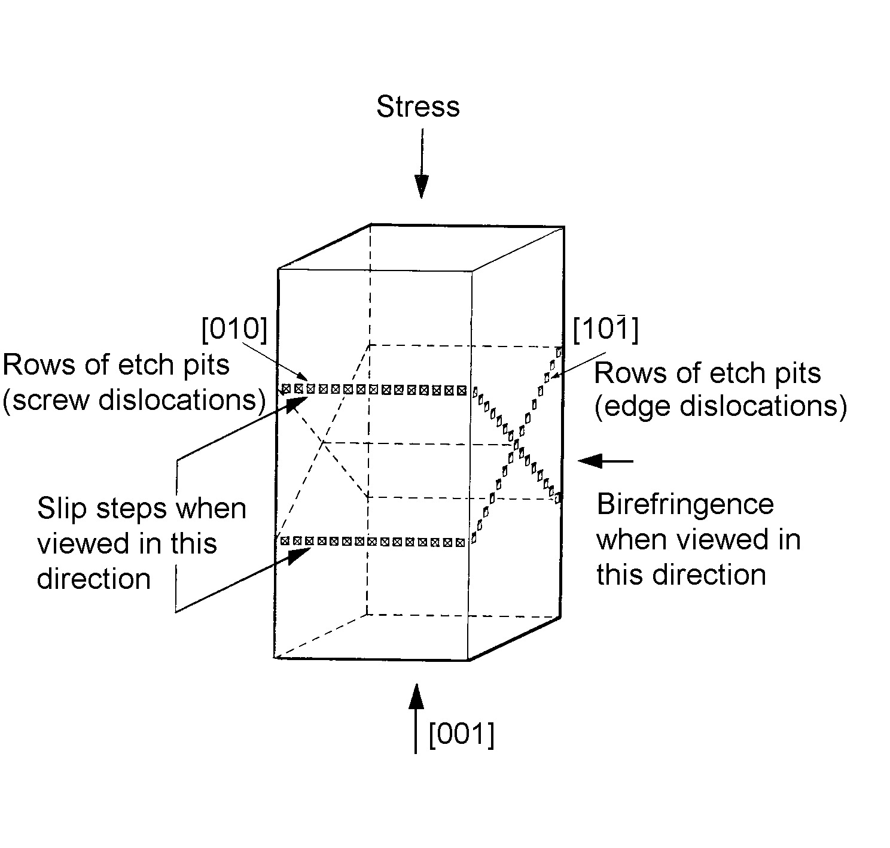

## Winkel zwischen Ätzgrübchen
Für den Winkel zwischen den Kristalliten $\theta$, die in einer Korngrenze aufeinander treffen, lässt sich geometrisch folgender Zusammenhang zum Abstand $d$ zweier Ätzgrübchen und dem Betrag $b$ des Burgers-Vektors finden.

$$
\begin{eqnarray}
	\sin(\theta) &=& \frac{b}{d}
\end{eqnarray}
$$
Ist die Korngrenze eine Kleinwinkelkorngrenze ($\theta < 15^\circ$), so lässt sich die Kleinwinkelnäherung für den Sinus nutzen.

$$
\begin{eqnarray}
	\sin(\theta) &\approx& \theta \\
	\Rightarrow \theta &\approx& \frac{b}{d}
\end{eqnarray}
$$
Der wahrscheinlichste Burgers-Vektor $\vec{b}$ für $\mathrm{LiF}$ ist wie beschrieben der Vektor $[\frac{1}{2}\,0\,\frac{1}{2}]$ mit einer Länge von $b = \frac{a}{\sqrt{2}}$.
$$
\begin{eqnarray}
	\theta &\approx& \frac{a}{\sqrt{2} \cdot d} \\
		&=& \frac{0.402\,\mathrm{nm}}{\sqrt{2} d}\\
	\theta &\approx& \frac{0.284\,\mathrm{nm}}{d} \tag{theta}
\end{eqnarray}
$$

# Durchführung
## Vorbereitung der Proben
Eine Probe $\mathrm{LiF}$-Kristall mit äußeren Abmessungen von etwa $15 \times 3 \times 3 \,\mathrm{mm^3}$ wird zur Verfügung gestellt. Es wurde zuvor von einem größeren Kristall durch Spalten abgetrennt und dann für $48$ Stunden bei $650\,^\circ\mathrm C$  getempert und langsam abgekühlt.

Eine zweite wird zu Beginn des Versuchs von einem größeren Block abgespalten. Diese wird nicht getempert, allerdings chemisch poliert und geätzt. Das Abspalten erfolgt mit einem Beitel, der parallel zu einer Seitenfläche des großen Blocks angesetzt wird.

## Polieren und Ätzen
Mit dem chemischen Poliermittel wird eine Schicht von mehreren Mikrometern abgetragen, um durch das Spalten entstandene Defekte an der Oberfläche zu verringern. Durch das Ätzen werden insbesondere Stellen mit Defekten angegriffen, dadurch entstehen sich pyramidenförmige Ätzgrübchen auf den $\{1\,0\,0\}$-Flächen des Kristalls.

Das Poliermittel besteht zu $35\,\mathrm{Vol\%}$ aus Tetrafluoroborsäure $(\mathrm{HBF_4})$, zu $30\,\mathrm{Vol\%}$ aus Salpetersäure $(\mathrm{HNO_3})$ und zu $60\,\mathrm{Vol\%}$ aus Wasser $(\mathrm{H_2O})$. Das Ätzmittel ist $50\,\mathrm{ppm}$ Eisen(III)-Chlorid $(\mathrm{FeCl_3})$ in destiliertem Wasser.

Beide Proben wurden für $19\mathrm{\,min}$ in das Poliermittel gegeben. Nach $13.5\mathrm{\,min}$ wurden sie umgedreht, sodass alle Seiten poliert wurden. Daraufhin wurden sie mit Ethanol abgespült, jeweils $6.5\mathrm{\,min}$ geätzt und wiederum mit Ethanol abgespült.

## Ätzgrübchendichten & Kleinwinkelkorngrenzen
Daraufhin wurden die Proben daraufhin untersucht, welche Seite die wenigsten Schäden und Stufen hat. Diese Seite wurde jeweils für die folgenden Messungen verwendet.

Daraufhin wurden je Probe zwei Aufnahmen aufgenommen, auf denen Ätzgrübchen erkennbar sind. Bei der getemperten Probe wurden je eine Aufnahme bei $2000$-facher und bei $1000$-facher Vergrößerung gemacht, bei der ungetemperten Probe je eine Aufnahme bei $1000$-facher und $500$-facher Vergrößerung.

Dann wurden drei Kleinwinkelkorngrenzen auf der getemperten Probe gesucht und bei $2000$-facher Vergrößerung vermessen. Hierzu wurden jeweils $4$ bis $6$ Ätzgrübchen abgezählt.

## Nadeldruckrosetten
Auf der getemperten Probe wurden an drei möglichst defektfreien Stellen Eindrücke mit einer Nadel gemacht. Daraufhin wurde die Probe erneut für $6\mathrm{\,min}$ geätzt und danach mit Ethanol abgespült.

Die dabei entstandenen Rosetten wurden fotografiert. Dazu wurde zunächst eine Übersicht bei $50$-facher Vergrößerung aufgenommen und dann Einzelaufnahmen bei $200$- bzw. $150$-fachen Vergrößerungen aufgenommen. Hierbei fiel direkt auf, dass die Rosette im Zentrum der Probe größere Ausmaße hatte, weswegen eine geringere Vergrößerung als für die anderen beiden Rosetten notwendig war, um die gesamte Rosette abzubilden.

## Eingespannte Probe
Nun wurde die Probe hochkant so in eine Presse eingespannt, dass die vermessene Seite senkrecht war. Die Spannung wurde durch ein Gesamtgewicht von $1.789\mathrm{\,kg}$ erzeugt, das durch die obere Hälfte der Presse und ein Zusatzgewicht von $841\mathrm{\,g}$ erzeugt wurde.

Nach $2\mathrm{\,min}$ wurde die Probe herausgeholt und erneut für $6\mathrm{\,min}$ geätzt. Nach erneuten Abspülen mit Ethanol wurden die Rosetten erneut fotografiert. Hierbei wurde darauf geachtet, dass sowohl alte Ätzgrübchen als auch durch Wandern neu entstandene Ätzgrübchen auf den Fotos sichtbar waren. Dies lässt sich durch die Größe und Form der Ätzgrübchen unterscheiden.

Zuletzt wurde eingespannte Fläche vermessen. Dazu wurde die Probe senkrecht auf das Mikroskop gestellt, sodass die Orientierung der Probe der Orientierung beim Einspannen entsprach. Mithilfe des Mikroskops wurde die Oberfläche der Probenschmalseite vermessen.

# Auswertung
### Ätzgrübchendichte
#### Berechnung
Die Ätzgrübchendichte ist an verschiedene Stellen der jeweiligen Proben sehr unterschiedlich, da durch die Ätzgrübchendichte lokale Unebenheiten dargestellt werden.

Um die insgesamte Ätzgrübchendichte der beiden Proben abzuschätzen, wurden für jede Probe an zwei repräsentativen Stellen Ätzgrübchen aufgenommen, wobei die Ätzgrübchendichte $N$ durch die Anzahl $n$ der Ätzgrübchen und die Fläche $F$ bestimmt ist. Die Ungenauigkeit $\Delta N$ der Ätzgrübchendichte ist nach Gauß'scher Fehlerfortpflanzung zu bestimmen.

$$
\begin{eqnarray}
	N &=& \frac{n}{F} \tag{N}\\
	\Delta N &=& \sqrt{
		\left(\frac{\Delta n}{F}\right)^2
		+ \left(\frac{n}{F^2} \cdot \Delta F\right)^2} \tag{DeltaN}
\end{eqnarray}
$$

Der Fehler der Anzahl der Ätzgrübchendichte $\Delta n$ hängt neben menschlicher Ablesefähigkeit auch von der Schärfe des jeweiligen Bildes ab. Wir schätzen ihn dennoch für alle Bilder auf $10\,\%$, da in unserem Fall die Bilder mit höherer Unschärfe auch die kleinere Anzahl an Ätzgrübchen haben. Der Fehler der Fläche $\Delta F$ ist durch die Genauigkeit der Streckenangabe des Mikroskops gegeben und beträgt $\Delta F=(0.005 \mathrm{\, \mu m})^2$.

Um die durchschnittliche Ätzgrübchendichte der Proben zu bestimmen, nehmen wir den Mittelwert der Dichten an den zwei Stellen, die Ungenauigkeit ist durch die Standardabweichung gegeben.

$$
\begin{eqnarray}
	\bar{N} &=& \frac{N_1 + N_2}{2} \tag{Nbar}\\
	\Delta \bar N &=& \left| \frac{N_1 - N_2}{2} \right| \tag{DeltaNbar}
\end{eqnarray}
$$

#### Nicht-getemperte Probe
Wie in Abbildung $1??$ zu sehen, sind in den inneren sechs blauen Quadraten insgesamt $5\pm1$ Ätzgrübchen zu finden, die Quadrate haben jeweils eine Seitenlänge von $200.00 \mathrm{\,\mu m}$.

An der zweiten Stelle der nicht getemperten Probe (siehe Abbildung $2??$) sind in den inneren sechs blauen Quadraten $16\pm1$ Ätzgrübchen zu finden, die Quadrate hier je eine Seitenlänge von $100.00 \mathrm{\, \mu m}$.

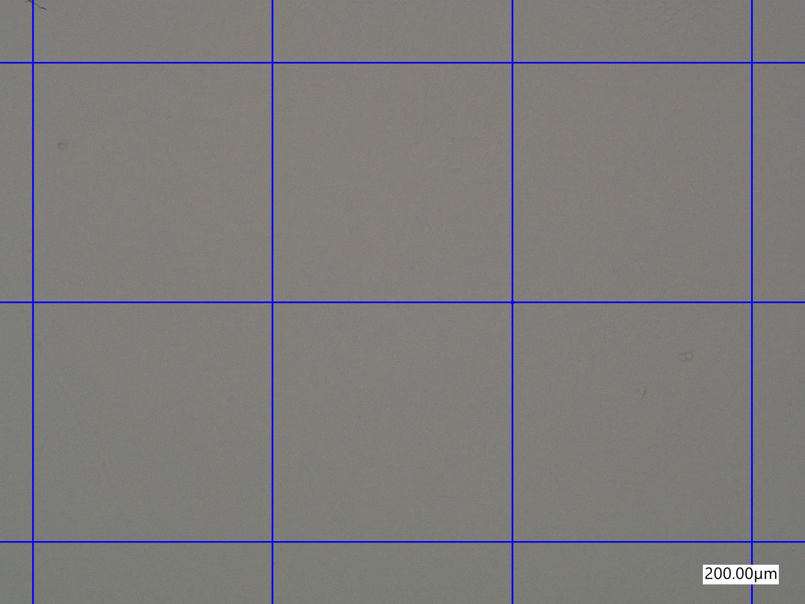
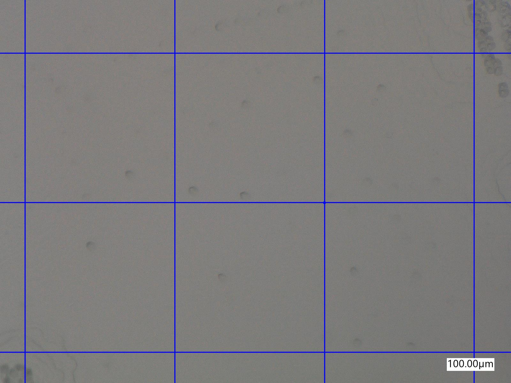

Mithilfe der Gleichungen $(\mathrm{N})$ bis $(\mathrm{DeltaNbar})$ folgt die mittlere Ätzgrübchendichte $\bar N_\mathrm{nt}$ der nicht-getemperten Probe.

$$
\begin{eqnarray}
	N_\mathrm{nt,1} &=& (2.1 \pm 0.4) \cdot 10^3 \mathrm{\, cm^{-2}} \\
	N_\mathrm{nt,2} &=& (2.7 \pm 0.3) \cdot 10^{4} \mathrm{\, cm^{-2}} \\
	\bar N_\mathrm{nt}
		&=& (1.4 \pm 1.2) \cdot 10^4 \mathrm{\, cm^{-2}}
		\quad(\pm 85.52\,\%)
\end{eqnarray}
$$

#### getemperte Probe
In Abbildung $3??$ sind insgesamt $50$ Ätzgrübchen in den inneren acht blauen Quadraten zu entdecken. Jedes dieser Quadrate hat eine Seitenlänge von $150.00 \mathrm{\, \mu m}$.

Die zweite Stelle der getemperten Probe ist in Abbildung $4??$ zu sehen. Dort sind $81\pm8$ Ätzgrübchen in den inneren zwölf blauen Quadraten zu finden. Jedes der Quadrate hat eine Seitenlänge von $70.00 \mathrm{\, \mu m}$.

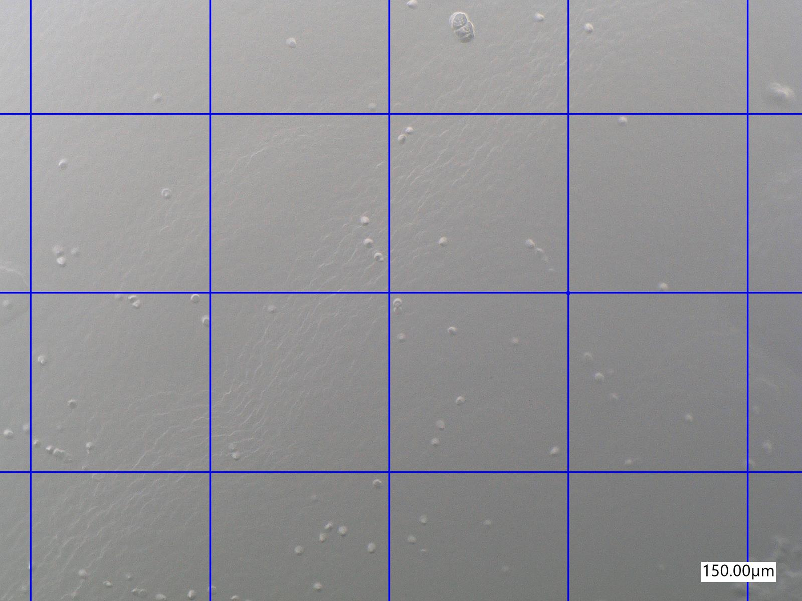
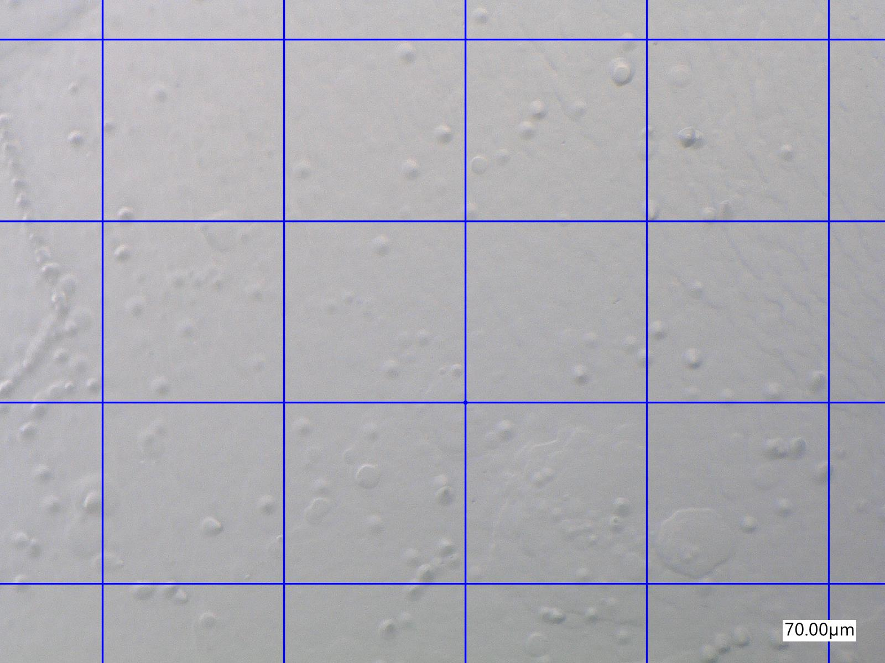

Wieder folgt aus den Gleichungen $(\mathrm{N})$ bis $(\mathrm{DeltaNbar})$ die mittlere Ätzgrübchendichte $\bar N_\mathrm{t}$ der getemperten Probe.

$$
\begin{eqnarray}
	N_\mathrm{t,1} &=& (2.8 \pm 0.3) \cdot 10^4 \mathrm{\, cm^{-2}} \\
	N_\mathrm{t,2} &=& (1.4 \pm 0.1) \cdot 10^5 \mathrm{\, cm^{-2}}
	\\
	\bar N_\mathrm{t}
		&=& (8.3 \pm 5.5) \cdot 10^4 \mathrm{\, cm^{-2}}
		\quad(\pm 66.44\,\%)
\end{eqnarray}
$$

#### Diskussion
Die großen Fehler in den Mittelwerten der Ätzgrübchendichten folgen daraus, dass wir nur zwei typische Stellen pro Probe verwenden um die durchschnittliche Ätzgrübchendichte der gesamten Probe zu bestimmen. Die Ergebnisse sind trotzdem gut interpretierbar.

Eigentlich würden wir erwarten, dass die Ätzgrübchendichte und damit die Versetzungsdichte der getemperten Probe niedriger ist als die der nicht getemperten Probe, da sich die Versetzungen in der Probe beim Temperungsprozess auslöschen. $[1]$

Hier erhalten wir aber das Gegenteil. Die Ätzgrübchendichte der getemperten Probe ist mit ca. $\bar N_\mathrm{t}=(8.3\pm 5.5) \cdot 10^4 \mathrm{\, cm^{-2}}$ selbst innerhalb der Fehlergrenzen größer als die Ätzgrübchendichte der nicht getemperten Probe $\bar N_\mathrm{nt}=(1.4 \pm 1.2) \cdot 10^4 \mathrm{\, cm^{-2}}$.

Dies kann mehrere Ursachen haben. Die erste Möglichkeit ist, dass unsere ausgesuchten repräsentativen Stellen doch nicht so repräsentativ sind wie wir dachten. Wir hätten z.B. aus Versehen eine oder beide Stellen der getemperten Probe innerhalb einer stark beschädigten Zone wählen können.

Dies führt direkt zur zweiten Möglichkeit. Es kann sein, dass die getemperte Probe nach dem Tempern beschädigt wurde und so neue Versetzungen hinzukamen.

In beiden Fällen ist das gemessene Ergebnis nicht undenkbar, wenn auch unerwartet. Der Effekt des Temperns auf die Ätzgrübchendichte der Probe konnte somit zwar nicht beobachtet werden. Dennoch konnte ein Gefühl für die Menge an Versetzungen in $\mathrm{LiF}$ entwickelt werden.

### Kleinwinkelkorngrenze
Es wurden drei Bilder von Kleinwinkelkorngrenzen aufgenommen. Nun werden die Winkel $\theta$ zwischen den Kristalliten an diesen Kleinwinkelkorngrenzen bestimmen. Dieser durch Gleichung $(\mathrm{theta})$ gegeben, wobei $d$ den Abstand zweier Ätzgrübchen beschreibt.

Die Ungenauigkeit der Gitterkonstante  $\Delta a=1 \cdot 10^{-7} \mathrm{\, \mu m}$ $[5]$ und die des Mikroskops $\Delta d_m = 5 \cdot 10^{-3} \mathrm{\, \mu m}$ ergeben mittels Gauß'scher Fehlerfortpflanzung die Ungenauigkeit des Winkels $\Delta \theta$. Wird der Abstand $d_n$ von $n$ Grübchen gemessen, so sinkt die Ungenauigkeit $\Delta d$ des Abstandes zweier Grübchen.

$$
\begin{eqnarray}
	\Delta d &=& \frac{\Delta d_m}{n} \\
	\Delta \theta &=& \sqrt{
		\left(\frac{\Delta a}{\sqrt{2} \cdot d} \right)^2
			+ \left( \frac{a}{\sqrt{2} \cdot d^2} \cdot \Delta d \right)^2 }
			\tag{DeltaTheta}
\end{eqnarray}
$$

#### erste Messung
In Abbildung $5??$ ist die erste Kleinwinkelkorngrenze zu sehen. In rot ist der Abstand $18.28 \mathrm{\, \mu m}$ für $5$ Ätzgrübchen eingetragen.

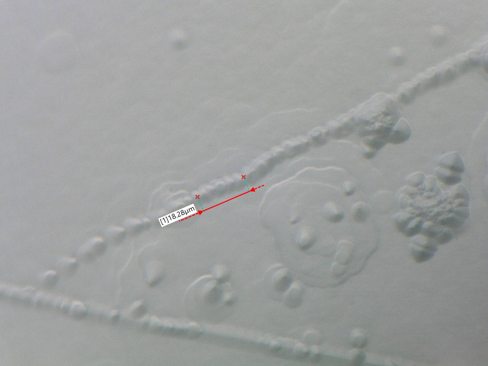

Aus $(\mathrm{theta})$ und $(\mathrm{DeltaTheta})$ folgt der erste Abstand $d_1$, woraus der Winkel $\theta_1$ bestimmt wird.

$$
\begin{eqnarray}
	d_1 &=& (3.656 \pm 0.002) \mathrm{\, \mu m} \\
	\theta_1 &=& (7.775 \pm 0.005) \cdot 10^{-5} \mathrm{\, rad} \\
		&=& (4.455 \pm 0.003) \cdot 10^{-3\ \ \circ}
\end{eqnarray}
$$

#### zweite Messung
Die zweite von uns aufgenommene Kleinwinkelkorngrenze ist in Abbildung $6$ zu sehen. Hier ist wieder der Abstand von $5$ Ätzgrübchen mit $14.53 \mathrm{\, \mu m}$ eingetragen.

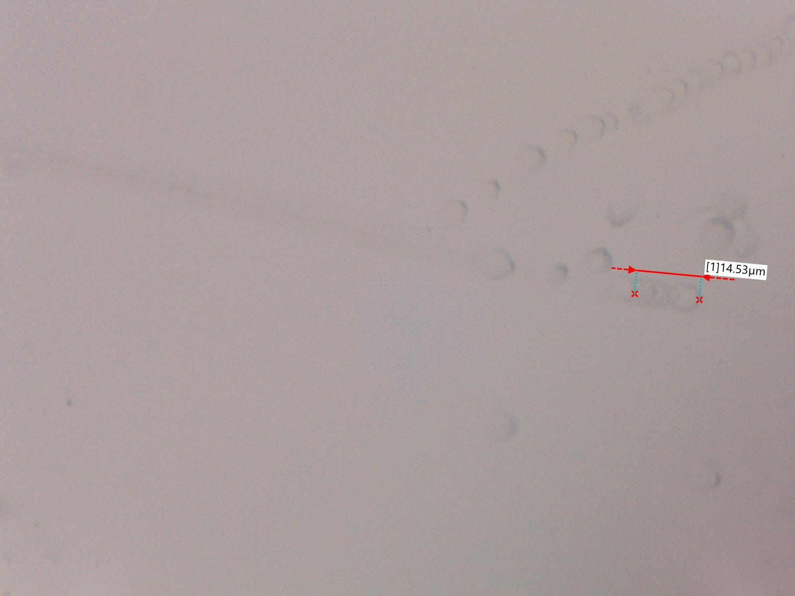

Der Abstand zweier Ätzgrübchen $d_2$ sowie der Winkel $\theta_2$ werden analog bestimmt.
$$
\begin{eqnarray}
	d_2 & = & (2.096\pm 0.002) \cdot 10^{-3} \mathrm{\, \mu m} \\
	\theta_2 &=& (9.782 \pm 0.008) \cdot 10^{-5} \mathrm{\, rad} \\
		&=& (5.605 \pm 0.005) \cdot 10^{-3\ \circ}
\end{eqnarray}
$$

#### dritte Messung
An der letzten untersuchten Stelle ist der Abstand für $3$ Ätzgrübchen von $16.76 \mathrm{\, \mu m}$ zu sehen, siehe Abb. $7$.

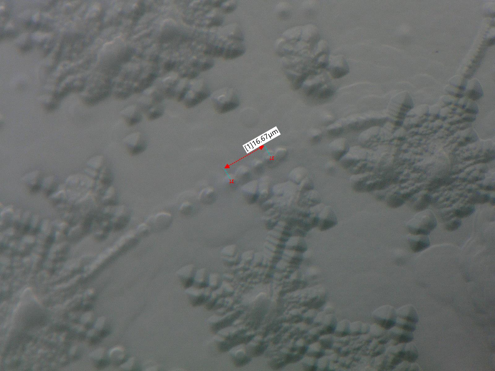

Erneut werden der Abstand zweier Ätzgrübchen $d_2$ sowie der Winkel $\theta_2$ analog bestimmt.
$$
\begin{eqnarray}
	d_3 &=& (5.587 \pm 0.003) \mathrm{\, \mu m} \\
	\theta_3 &=& (5.088 \pm 0.003) \mathrm{\, rad} \\
		&=& (2.915 \pm 0.002) \cdot 10^{-3\ \circ} \\
\end{eqnarray}
$$

#### Diskussion
Alle drei ermittelten Kleinwinkelkorngrenzen auf der getemperten Probe hatten einen Winkel im Bereich von einigen Milligrad. Damit fallen sie alle deutlich in den Bereich einer Kleinwinkelkorngrenze, wodurch die hier getätigte Kleinwinkelannahme gerechtfertigt ist.

### Nadeldruckrosetten
Die Mikroskopbilder von allen drei Rosetten sind zusammen und einzeln in den Abbildungen $8$ - $11$ zu sehen.

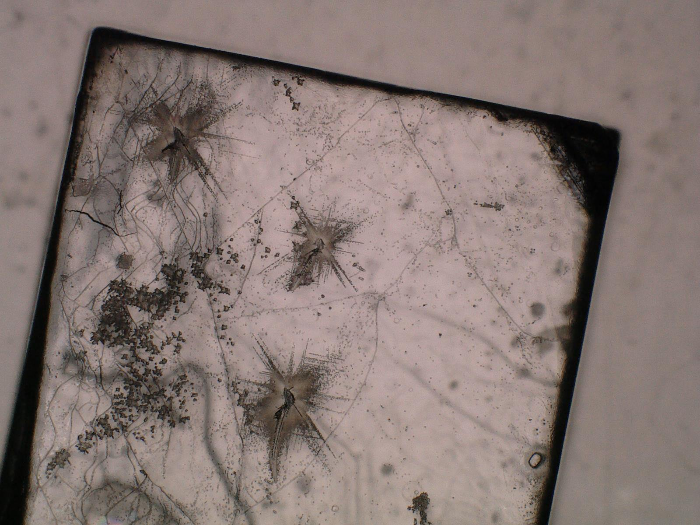
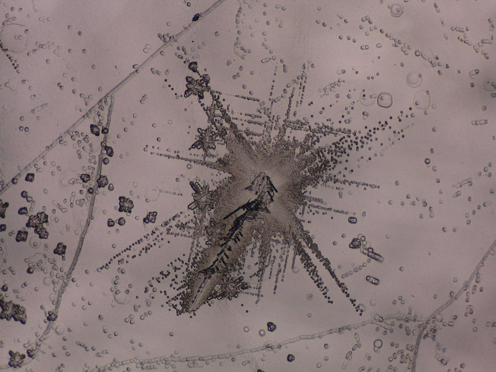
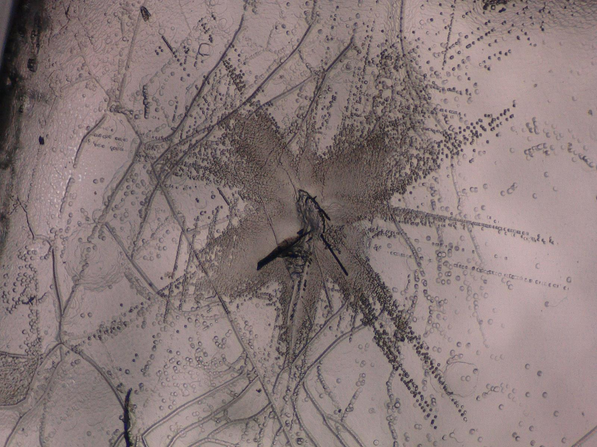
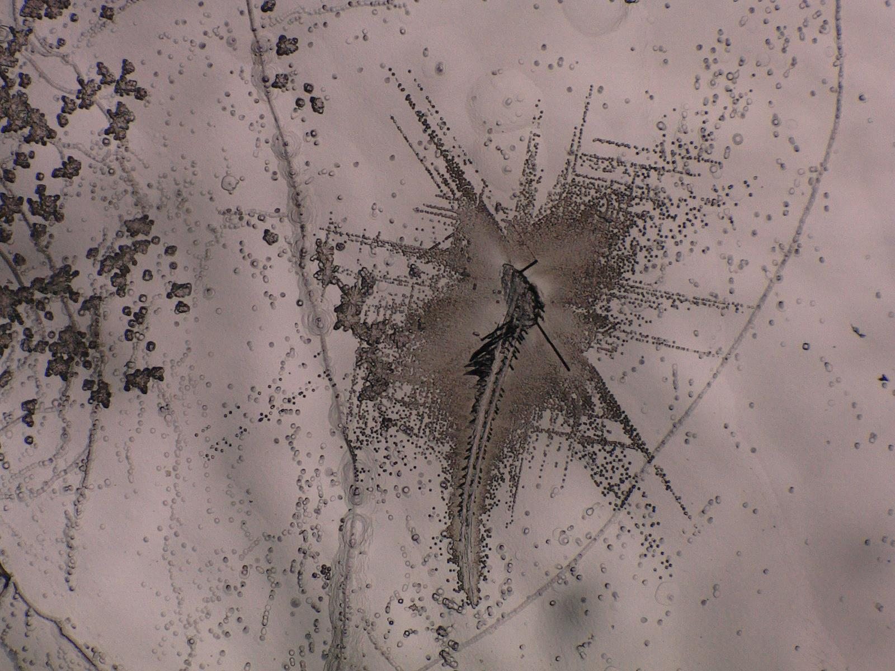

Entsprechend der Theorie kann man erkennen, dass die Ätzgrübchen entlang bestimmten Richtungen verlaufen. Zudem sieht man in Abbildung $11$, dass die Nadel an der dritten Stelle abgerutscht ist.

Auf den Horizontalen und Vertikalen sind die Versetzungsarme deutlich weniger ausgeprägt als auf den Diagonalen. Dies liegt dran, dass der kürzeste Burgersvektor in den $\braket{110}$-Richtungen zeigt. In diesen Richtungen treten auch die Stufenversetzungen auf. Die weniger ausgeprägte Arme zeigen in den $\braket{100}$-Richtungen, wo sich Schraubenversetzungen bewegen. Diese Richtungen haben den zweitkürzesten Burgersvektor und haben damit die zweitniedrigste Bindungsenergie.

Die Ergebnisse entsprechen die Theorie und unsere Erwartung.

### Versetzungswanderung
### Schubspannung

# Literatur
1. Dislocations in Lithiumfluoride, C. Newey und R. Davidge, editiert von A. Bailey, Online verfügbar unter [https://ph2.uni-koeln.de/fileadmin/Lehre/PraktikumB/Dislocations_in_Lithium_Fluoride.pdf](https://ph2.uni-koeln.de/fileadmin/Lehre/PraktikumB/Dislocations_in_Lithium_Fluoride.pdf), 1965
2. C. Kittel, Einführung in die Festkörperphysik, München: Oldenbourg Verlag, 2005
3. S. Hunklinger, Festkörperphysik, München: Oldenbourg Verlag, 2011
4. R. Gross und A. Marx, Festkörperphysik, München: Oldenbourg Verlag, 2012
5. Universität zu Köln, "Anleitung zum Versuch 2.8 Versetzungen in LiF", Online verfügbar unter [https://ph2.uni-koeln.de/fileadmin/Lehre/PraktikumB/B28-LiF_tutorial_de.pdf](https://ph2.uni-koeln.de/fileadmin/Lehre/PraktikumB/B28-LiF_tutorial_de.pdf), Juni 2013
