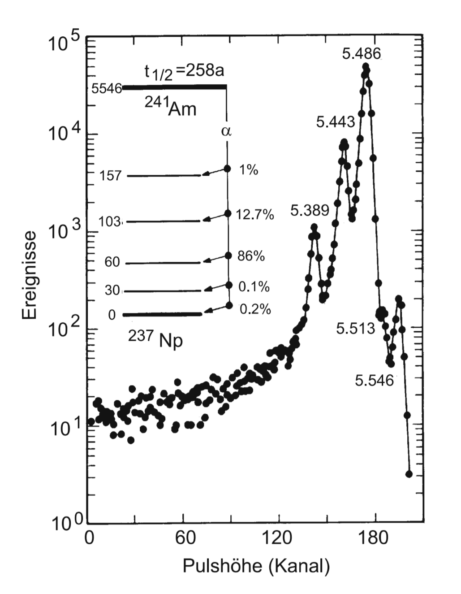
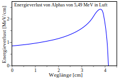
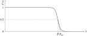
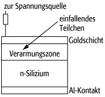

# radioaktiver Zerfall
Bei radioaktivem Zerfall wandelt sich ein Atomkern in einen anderen Atomkern um, indem Teilchen ausgestoßen werden.

Es wird zwischen Alphazerfall $(\alpha)$, $\beta$-Zerfall und $\gamma$-Zerfall unterschieden. Der Energiegewinn durch den Zerfall wird durch den $Q$-Wert beschrieben, wozu die Weizsäcker Massenformel relevant ist.

Um die Überwindung des Potentials des Atomkerns durch das Alphateilchen zu erklären, ist der Tunneleffekt notwendig. Die Wahrscheinlichkeit dafür ist ein Bestandteil der Zerfallswahrscheinlichkeit eines Teilchens.

Wie auch andere geladene Teilchen werden auch $\alpha$- und $\beta$-Strahlung durch Materie abgebremst. Die Reichweite der Strahlung kann empirisch mit der Bragg-Kleemann-Formel ermittelt werden, wenn sie für einen anderen Stoff bekannt ist.

## $\pmb{\alpha}$-Zerfall
Der $\alpha$-Zerfall ist eine Form des radioaktiven Zerfalls, bei dem ein Heliumkern $\ce{^4_2He}$ emittiert wird. Nach der Nuklidkarte findet der Zerfall hauptsächlich bei schweren Kernen statt.

$$
\begin{eqnarray}
        \ce{^A_ZX -> ^{A-4}_{Z-2}Y + ^4_2He}
\end{eqnarray}
$$

Um das Kernpotential zu überwinden, müssen die $\alpha$-Teilchen durch eine Potentialbarriere tunneln. Die Reichweite von Alphastrahlung in Luft liegt bei ca. $\pu{4 cm}$.

## $Q$-Wert
Der $Q$-Wert beschreibt die Energiedifferenz $Q$ zwischen Ausgangs- und Endprodukt im radioaktiven Zerfall.

Er wird durch die Massendifferenz zwischen Mutterkern $\ce{^A_ZX}$, Tochterkern $\ce{^{A-4}_{Z-2}Y}$ und die emittierten Teilchen darstellt. Diese wird durch die Masse-Energie-Relation in eine Energie umgerechnet, wozu die Lichtgeschwindigkeit $c$ verwendet wird.

Für Alphastrahlung, bei der ein Heliumkern $\ce{^4_2He}$ emittiert wird, wird $Q$ folgendermaßen berechnet. Dabei wird die Masse $m_A$ durch die Weizsäcker Massenformel beschrieben.

$$
\begin{eqnarray}
        \frac{Q}{c^2} &=&
                m_{A}
                        \left(\ce{^A_ZX}\right)
                        - m_{A}\left(\ce{^{A-4}_{Z-2}Y}\right)
                        - m_{A}\left(\ce{^4_2He}\right)
\end{eqnarray}
$$

## Energie von $\pmb{\alpha}$-Teilchen
Die kinetische Energie $E_\alpha$ der Alphateilchen kann über die Atommassen $m_A$ von Tochterkern $\ce{^{A-4}_{Z-2}Y}$ und Heliumkern $\ce{^4_2He}$ sowie die freigesetzte Energie $Q$ ermittelt werden.

$$
\begin{eqnarray}
        E_\alpha
                &=& \frac{m_{A}\left(\ce{^{A-4}_{Z-2}Y}\right) \cdot Q}
                        {m_{A}\left(\ce{^{A-4}_{Z-2}Y}\right)+m_{A}\left(\ce{^4_2He}\right)}
\end{eqnarray}
$$

Die Massen $m_A$ werden durch die Weizsäcker Massenformel beschrieben. Zur Herleitung der obigen Relation ist zudem die Impulserhaltung relevant.

## Kernpotential
Das Kernpotential beschreibt die potentielle Energie innerhalb eines Atomkerns, die die Nukleonen zusammenhält. Es beruht auf der starken Wechselwirkung sowie der Coulomb-Wechselwirkung innerhalb des Kernes.

Um den Kern herum bewirkt die elektromagnetische Wechselwirkung eine Abstoßung zwischen einem positiv geladenen Teilchen und dem ebenso geladenen Kern. Beide Potentiale wirken zusammen und bilden ein quasibindenes Potenzial mit einer endlichen Coulombbarriere.

### Coulomb-Barriere
Ein geladenes Teilchen muss zum Verlassen des Atomkerns durch die Coulomb-Barriere $V_C$ tunneln. Sei $z$ die Ladung des Teilchens und $Z$ die des Kerns, dann wirkt am Rand eines Kerns mit Kernradius $R$ folgendes Potential.

$$
\begin{eqnarray}
    V_C &=& \frac{1}{4\pi\varepsilon_0} \frac{zZe^2}{R}
\end{eqnarray}
$$

## Tunneleffekt beim $\pmb{\alpha}$-Zerfall
Die Energie eines Alphateilchens ist nicht groß genug, um die Potentialbarriere zu überwinden. Deswegen muss es hindurch tunneln.

Protonen und Neutronen sind in schweren Kerne mit einer Energie bis zu $7\mathrm{\,MeV}$ im Kernpotential gebunden und können daher nicht einzeln den Kern verlassen. Deshalb ist eine Emission eines gebundene System wahrscheinlicher, da zusätzliche Bindungsenergie zur Verfügung steht. Die Bildung eines $\alpha$-Teilchens mit einer Bindungsenergie von etwa $7.1\mathrm{\,MeV}$ ermöglicht das Verlassen des Kerns durch die Coulombbarriere $V_C$.

Das Tunneln geschieht mit einer bestimmten Wahrscheinlichkeit, der Tunnelwahrscheinlichkeit $T$. Diese wiederum hängt von dem Gamow-Faktor $G$ ab.

$$
\begin{eqnarray}
        T &=& T_0 \cdot e^{-G} \\
        G &=&
                \frac{2\sqrt{2m_\alpha}}{\hbar}
                \int_{r_{1}}^{r_{2}}\sqrt{V_{C}-E_{\alpha}}
                \,\mathrm dr
\end{eqnarray}
$$

## Zerfallswahrscheinlichkeit
Damit ein radioaktiver Zerfall stattfindet, müssen drei Ereignisse in Folge stattfinden, die jeweils mit unterschiedlichen Wahrscheinlichkeiten geschehen.

1. Zuerst muss das auszustoßende Teilchen im Kern verfügbar sein. Im Falle des Alphazerfalls muss sich dazu ein Alphateilchen bilden, im Falle von $\beta$-Zerfall muss sich ein Nukleon umgewandelt haben.
2. Dann muss dieses Teilchen am Rand des Atomkerns gegen die Coulomb-Barriere stoßen, die den Kern zusammenhält.
3. Zuletzt muss das Teilchen durch die Barriere tunneln.

Die Wahrscheinlichkeiten für diese drei Prozesse multiplizieren sich zu der gesamten Zerfallswahrscheinlichkeit für den Atomkern.

## Energiespektrum
Bei dem radioaktiven Zerfall eines Mutterkerns können außer dem Grundzustand noch andere angeregte Zustände des Tochterkerns besetzt werden. Man erhält ein diskretes Linienspektrum.

Bei einer Messung wird jede Linie nur mit einer gewissen Wahrscheinlichkeit gemessen, dabei wird jede Linie durch eine Gauß-Verteilung angenähert.

## Americium
Americium $\ce{^{241}Am}$ ist ein radioaktives Element, das vollständig durch Alphastrahlung zerfällt. Die meisten Alphateilchen haben eine Energie von $E_\alpha\approx 5.486 \mathrm{\,MeV}$.

Dadurch wird ein $\alpha$-Teilchen in Luft ca. $\braket{N} \approx 3.8 \cdot 10^5$ Stöße mit gebundenen Elektronen absolvieren, bevor es gestoppt wird.[^1]

Das Energiespektrum von $\ce{^{241}Am}$ hat vier Linien bei Energien von $5388\mathrm{\,keV}$ bis $5545\mathrm{\,keV}$.

[^1]: Dies kann aus der [[#Bethe-Bloch-Gleichung]] ermittelt werden, indem die [[#Abschätzung der Anzahl von Stößen|Anzahl von Stößen]] abgeschätzt wird.

## Weizsäcker Massenformel
Die Weizsäcker Massenformel beschreibt die Masse von Atomkernen.

Die Masse $m$ eines Atomkerns besteht aus der Gesamtmasse der $N$ Neutronen (mit Masse $m_N$) und der Gesamtmasse der $P$ Protonen (mit Masse $m_P$), die um die Bindungsenergie $E_B$ reduziert wird.

$$
\begin{eqnarray}
        m &=& N\cdot m_N + P\cdot m_P - \frac{E_B}{c^2}
\end{eqnarray}
$$

Die Bindungsenergie $E_B$ wird durch die Weizsäcker Formel beschrieben und mithilfe der Masse-Energie-Relation in eine Masse umgewandelt.

### Weizsäcker Formel
Die Weizsäcker Formel gibt die Bindungsenergie eines Atomkerns an. Sie basiert einerseits auf empirischen Daten, andererseits auf dem Tröpfchenmodell der Kernphysik. Aus ihr wird die Weizsäcker Massenformel ermittelt. Diese beschreibt die Verringerung der Masse des Atomkerns durch die Bindungsenergie.

Die Bindungsenergie setzt sich aus verschiedenen Teilen zusammen. Die einzelnen Terme werden durch die empirisch ermittelten Faktoren $a_i$ sowie die Nukleonenzahl $A$, Protonenzahl $Z$ und Neutronenzahl $N$ beschrieben. Hierbei handelt es sich um den Volumenterm $E_V$, den Oberflächenterm $E_O$, den Coulombterm $E_C$, den Symmetrieterm $E_S$ und den Paarungsterm $E_P$. Bis auf den Volumenterm haben alle Terme ein negatives Vorzeichen, sie reduzieren die Bindungsenergie.

$$
\begin{eqnarray}
        E_B &=& E_V + E_O + E_C + E_S + E_P
\end{eqnarray}
$$

### Volumenterm
Der Volumenterm $E_V$ ist der einzige attraktive Bestandteil Bindungsenergie in Atomkernen und beschreibt die Anziehung der Nukleonen durch die starke Wechselwirkung.

Die starke Wechselwirkung wirkt effektiv nur auf die nächsten Nachbarn eines Nukleons. Da die Dichte im Kern nach dem Tröpfchenmodell konstant ist, ist die gesamte Bindungsenergie durch die starke Wechselwirkung proportional zum Kernvolumen. Dieses wiederum ist proportional zu der dritten Potenz des Kernradius $R^3\propto A$, wobei $A$ die Nukleonenzahl beschreibt.

$$
\begin{eqnarray}
        E_V &=& + a_V\cdot A \\
        a_V &=& 15.85\mathrm{\,MeV}
\end{eqnarray}
$$

In der hiesigen Betrachtung wurde der Kern als unendlich groß angenommen. Weil es am Rand des Kerns weniger Nachbarn gibt, wird der Oberflächenterm zur Korrektur verwendet.

### Oberflächenterm
Der Oberflächenterm $E_O$ bildet einen repulsiven Bestandteil der Bindungsenergie in Atomkernen und hat daher ein negatives Vorzeichen. Er korrigiert den Volumenterm, indem der Rand eines endlichen Atomkerns berücksichtigt wird.

Da die Atome an der Oberfläche des Atomkerns weniger Nachbarn haben als die Nukleonen im Kern, wird sind die ersteren schwächer gebunden. Dadurch ist die Bindungsenergie in diesem Bereich geringer. Diese Korrektur ist proportional zur Oberfläche einer Kugel mit dem Kernradius $R$, also proportional zu $\sqrt[3]{A^2}$, wobei $A$ die Nukleonenzahl beschreibt.

$$
\begin{eqnarray}
        E_O &=& - a_O\cdot \sqrt[3]{A^2} \\
        a_V &=& 18.34\mathrm{\,MeV}
\end{eqnarray}
$$

### Coulombterm
Der Coulombterm $E_C$ ist ein repulsiver Beitrag zur Bindungsenergie in Atomkernen und beschreibt die elektrostatische Abstoßung der Protonen voneinander. Jedes der $Z$ Protonen wird von den anderen $(Z-1)$ Protonen abgestoßen.

Die Coulomb-Wechselwirkung ist proportional zum inversen Kernradius $R^{-1}$, daher auch proportional zu $(\sqrt[3]{A})^{-1}$, wobei $A$ die Nukleonenzahl beschreibt.

$$
\begin{eqnarray}
        E_C &=& - a_C\cdot \frac{Z(Z-1)}{\sqrt[3]{A}} \\
        a_C &=& 0.71\mathrm{\,MeV}
\end{eqnarray}
$$

Für große Kerne mit $Z\approx(Z-1)$ kann der Term $Z(Z-1)\approx Z^2$ vereinfacht werden.

### Symmetrieterm
Der Symmetrieterm $E_S$ beschreibt die Verringerung der Bindungsenergie in Atomkernen durch ein Ungleichgewicht von $Z$ Protonen und $N$ Neutronen in einem Kern mit $A$ Nukleonen.

$$
\begin{eqnarray}
        E_S &=& - a_S\cdot \frac{(N-Z)^2}{4A} \\
        a_S &=& 2.86\mathrm{\,MeV}
\end{eqnarray}
$$

Die Ursache kann quantenmechanisch erklärt werden. Protonen und Neutronen werden als Fermigas in einem Potentialtopf betrachtet. Beide Gase teilen sich denselben Potentialtopf und füllen Einteilchenniveaus bis zu ihrer jeweiligen Fermienergie auf. Sind genau gleich viele beider Teilchensorten vorhanden, so sind alle Zustände bis zur Fermienergie besetzt.

Gibt es jedoch ein Teilchen mehr von einer Sorte, so müssen höhere Energieniveaus besetzt werden. Sei z.B. ein Proton mehr vorhanden, so muss ein Proton ein höheres Energieniveau als alle anderen Nukleonen besetzen. Dies benötigt mehr Energie.

Wandelt man nun in einem symmetrischen Kern ein Nukleon um, so erhöht man die eine Fermienergie und senkt die andere ab. Dieser Prozess kostet Energie, der Betrag der Energie ist die Differenz zwischen den Ferminiveaus. Wenn man die Energiedifferenz in einer Tabelle aufträgt, sieht man, dass der Term erst am Anfang mit $(N-Z)$ wächst und bei Umschichtungen von drei Nukleonen eine besser Beschreibung das Wachstum mit $(N-Z)/2$ ist. Wenn man dann noch betrachtet, dass Abstand der Einteilchenniveaus mit steigendem Volumen sinkt, erhält man mit der Proportionalität zwischen Volumen und Nukleonenzahl $A$ obenstehende Formel.

### Paarungsterm
Der Paarungsterm $E_P$ beschreibt das Phänomen, dass gerade Anzahlen von Protonen bzw. Neutronen in einem Kern stabilere Kerne produzieren. Paare von Protonen oder Neutronen sind stärker gebunden als ein ungepaartes Proton oder Neutron.

Der Paarungsterm wird betragsmäßig kleiner, je größer die Nukleonenzahl $A$ ist. Dies wird durch die folgende Gleichung beschrieben.

$$
\begin{eqnarray}
        E_P &=&
                \begin{cases}
                        + a_P\cdot \frac{1}{\sqrt{A}} & \text{gg} \\
                        0 & \text{gu} \\
                        0 & \text{ug} \\
                        - a_P\cdot \frac{1}{\sqrt{A}} & \text{uu} \\
                \end{cases} \\
        a_P &=& 11.46\mathrm{\,MeV}
\end{eqnarray}
$$

Deswegen wird zwischen $\mathrm{gerade}$-$\mathrm{gerade}$-Kernen $(\mathrm{gg})$, $\mathrm{gerade}$-$\mathrm{ungerade}$-Kernen $(\mathrm{gu})$ und $\mathrm{ungerade}$-$\mathrm{gerade}$-Kernen $(\mathrm{ug})$ sowie $\mathrm{ungerade}$-$\mathrm{ungerade}$-Kernen $(\mathrm{uu})$ unterschieden. Erstere haben jeweils eine gerade Anzahl von Protonen und Neutronen, während letztere jeweils ungerade Anzahlen haben. $\mathrm{ug}$- und $\mathrm{gu}$-Kerne haben eine Nukleonensorte in gerader und die andere in ungerader Menge.

Bei einer geraden Anzahl derselben Nukleonensorte heben sich die Spins auf, bei einer ungeraden Anzahl nicht. Auf diese Weise kann das Phänomen mithilfe des Schalenmodells erklärt werden.

Beide Nukleonensorten liefern betragsmäßig den gleichen Beitrag zu $E_P$. Bei $\mathrm{gg}$- und $\mathrm{uu}$-Kernen addieren sich diese Werte zu einer nicht-verschwindenden Energie. Bei $\mathrm{gu}$- und $\mathrm{ug}$-Kernen heben sich die Terme dagegen auf, weswegen der Paarungsterm hier verschwindet.

### Kernradius
Der Kernradius $R$ kann durch den Radius $r$ eines einzelnen Nukleons und die Nukleonenzahl $A$ beschrieben werden.

$$
\begin{eqnarray}
        R &=& r \cdot \sqrt[3]{A}
\end{eqnarray}
$$

# Bremsvermögen
Das Bremsvermögen beschreibt die Fähigkeit eines Mediums, Strahlung abzubremsen. Es ist beispielsweise für die Reichweite von radioaktiver Strahlung relevant.

Für die Bremsung von Alphateilchen wird das Bremsvermögen $S(E)$ durch die Bragg-Kurve beschrieben.

$$
\begin{eqnarray}
    S(E) &=& - \frac{\Delta E}{\mathrm dx}(x) \\
        \frac{\Delta E}{\mathrm dx}(x) &=&
                \int_0^x \left(\frac{\mathrm dE}{\mathrm dx}\right) \mathrm dx^\prime
\end{eqnarray}
$$

Beispielsweise ein $\alpha$-Teilchen aus dem Americium-Isotop $\ce{^{241}Am}$ stößt mehrere hunderttausend Male, bevor es zur Ruhe kommt.

## relatives Bremsvermögen
Das relative Massenbremsvermögen $Q_A$ eines Absorbers $A$ kann durch das Bremsvermögen eines Standard-Absorbers $S$ ermittelt werden. Als Standard-Absorber wird beispielsweise Luft unter Normalbedingungen verwendet.

$$
\begin{eqnarray}
        Q_A \cdot \rho_A \cdot \mathrm dx_A
                &=& \rho_S \cdot \mathrm dx_S \\
        \Leftrightarrow \qquad\qquad\qquad Q_A
                &=& \frac{\rho_S}{\rho_A}
                        \cdot \frac{\mathrm dx_S}{\mathrm dx_A}
\end{eqnarray}
$$

Dieses Verhältnis kann näherungsweise aus dem Verhältnis der Massenbelegungen bzw. Flächendichten $\rho_i$ der Materialien ermittelt werden, was durch die Nukleonenzahlen $A_i$ und die Protonenzahlen $Z_i$ dargestellt werden kann. Hierbei werden die Korrekturterme der Bethe-Bloch-Gleichung vernachlässigt.

$$
\begin{eqnarray}
        Q_A &=& \frac{A_S\cdot Z_A}{A_A\cdot Z_S}
                \frac{\ln\left(\frac{2m_ev^2}{\bar I_A}\right)}{\ln\left(\frac{2m_ev^2}{\bar I_S}\right)}
\end{eqnarray}
$$

# Bethe-Bloch-Theorie
Bewegte und elektrisch geladene Teilchen werden durch Interaktion mit Materie abgebremst, indem sie durch Stöße mit Atomkernen sowie Elektronen wechselwirken. Schwere Teilchen mit einer Ruhemasse $M_0\gg m_e$ deutlich größer der Elektronen-Ruhemasse $m_e$ werden primär durch die Wechselwirkung mit Atomkernen gebremst, wodurch die Atome angeregt und ionisiert werden können.

Die Bethe-Bloch-Gleichung beschreibt den Verlust von Energie $E$ pro Strecke $x$ durch das Durchfliegen eines homogenen Bremsmediums. Die Bragg-Kurve beschreibt umgekehrt den Energieverlust abhängig von der Flugstrecke.

### Bethe-Bloch-Gleichung
Bewegte und eletrisch geladene Teilchen werden durch Interaktion mit Materie abgebremst, indem sie durch Stöße mit Atomkernen sowie Elektronen wechselwirken. Die Bethe-Bloch-Gleichung beschreibt den Verlust von Energie $E$ pro Strecke $x$ durch das Durchfliegen eines homogenen Bremsmediums nach der Bethe-Bloch-Theorie.

Dazu werden die Dichte $\rho$, die Atommassenzahl $A$ und die Ladungszahl $Z$ des Bremsmediums benötigt. Dabei wird von einem homogenen Medium mit $N$ Atomen pro Kubikzentimeter und der Kernladungszahl $Z\cdot e$ ausgegangen, wobei $e$ die Elementarladung darstellt. $\beta$ ist der Quotient aus Geschwindigkeit $v$ und Lichtgeschwindigkeit $c$, der auch in der Relativitätstheorie verwendet wird.

$$
\begin{eqnarray}
        N &=& \frac{\rho\cdot N_A}{A} \\
        \beta &=& \frac{v}{c}
\end{eqnarray}
$$

Ebenso werden die Ladungzahl $z$ und Geschwindigkeit $v$ des Projektils sowie die Elektronen-Ruhemasse $m_e$ verwendet. Weiterhin sind das mittlere Ionisationspotential $\bar I$, gemittelt über alle Atomschalen des Bremsmediums, sowie eine Korrektur $c_K$ notwendig. Letztere beschreibt den fehlenden Beitrag der $K$-Schalen-Elektronen bei kleinen Geschossenergien. Teilweise können diese Korrekturterme vernachlässigt werden.

$$
\begin{eqnarray}
        -\frac{\mathrm dE}{\mathrm ds} &=&
                \frac{4\pi z^2 e^4}{m_e v^2} NZ \cdot
                \left[
                        \ln\left(\frac{2m_ev^2}{\bar I}\right)
                        - \ln\left(1 - \beta^2\right)
                        - \beta^2
                        - \frac{c_K}{Z}
                \right] \\
        -\frac{\mathrm dE}{\mathrm ds} &\approx&
                \frac{4\pi z^2 e^4}{m_e v^2} NZ \cdot
                \ln\left(\frac{2m_ev^2}{\bar I}\right)
\end{eqnarray}
$$

Umgekehrt beschreibt die Bragg-Kurve den Energieverlust abhängig von der Flugstrecke.

### Herleitung
Im Folgenden werde die Bethe-Bloch-Gleichung für schwere, schnelle und geladene Projektile wie $\alpha$-Teilchen hergeleitet.

Hierbei wird eine quasi-klassische Betrachtung des Stoßvorganges angenommen. Da das Projektil sehr schwer im Vergleich zu Elektronen ist, kann seine Bewegung als näherungsweise linear angenommen werden. Weiterhin wird das Elektron als schwach gebunden und ruhend angenommen. Diese Annahmen können durch die hohe Geschwindigkeit und Masse des Projektils getätigt werden.

Da das Projektil das Elektron passiert, heben sich sämtliche Wechselwirkungen parallel zur Flugbahn auf. Dadurch muss nur die orthogonale Komponente der Coulomb-Kraft $\vec F$ betrachtet werden, die durch die Ladungen des Projektils $Q=ze$ und des Elektrons $q=-e$ im Abstand $\vec r$ erzeugt wird. Der Betrag des Abstands kann durch die Wegstrecke $x$ des Projektils sowie den orthogonalen Abstand $b$ der Flugbahn und des Elektrons als $r^2=x^2+b^2$ beschrieben werden.

$$
\begin{eqnarray}
        \vec F &=& \frac{Qq}{r^2} \frac{\vec{r}}{\left|\vec r\right|} \\
        \vec F &=& -\frac{ze^2}{x^2+b^2} \frac{\vec{r}}{\left|\vec r\right|}
\end{eqnarray}
$$

Weiterhin kann die Kraft $\vec F$ durch das elektrische Feld $\vec E$ des Projektils und die Ladung des Elektrons $q=-e$ beschrieben werden. Diese Gleichung wird integriert, um den Betrag des Impulsübertrages $\left|\Delta p_e\right|$ zu ermitteln. Dabei wird die Integration nach der Zeit durch eine Integration nach dem Ort substituiert, was durch die konstante Geschwindigkeit $v$ ermöglicht wird. Weiterhin wird die Symmetrie ausgenutzt, wodurch nur noch über die orthogonale Komponente integriert werden muss.

$$
\begin{eqnarray}
        \vec F &=& -e \vec E \\
        \left|\Delta p_e\right| &=& \int \vec F \mathrm dt \\
        \left|\Delta p_e\right| &=& \frac{e}{v} \int E_\perp \mathrm dx
\end{eqnarray}
$$

Darauf wird der Gauß'sche Integralsatz angewendet. Weiterhin wird der Energieübertrag $\Delta E$ durch die kinetische Energie $E=\frac{p^2}{2m_e}$ des Elektrons dargestellt. Dann kann über einen hohlen Zylinder vom Radius $b_\mathrm{min}$ bis $b_\mathrm{max}$ integriert werden. Sinnvolle Integrationsgrenzen sind notwendig, da das Integral sowohl bei $s=0$ als auch bei $s=\infty$ divergieren würde.

$$
\begin{eqnarray}
        -\left(\frac{\mathrm dE}{\mathrm ds}\right)
                &=& \frac{4\pi z^2 e^4}{m_ev^2}
                        \ln\left[\frac{b_\mathrm{max}}{b_\mathrm{min}}\right]
                        \propto \frac{z^2}{v^2}
\end{eqnarray}
$$

Nun werden relativistische Korrekturen durchgeführt, die zu der vollständigen Bethe-Bloch-Gleichung führen.

### Geltungsbereich
Die Bethe-Bloch-Gleichung gilt weder für sehr kleine, noch für sehr große Projektilenergien.

Bei sehr kleinen Energien kann nicht mehr davon ausgegangen werden, dass die Elektronen relativ zum Projektil in Ruhe liegen.

Bei sehr großen Energien kann z.B. die Wechselwirkung des Projektils mit dem Atomkern relevant werden, die in der hiesigen Betrachtung vernachlässigbar war.

Weiterhin muss das Projektil sehr schwer im Vergleich zu Elektronen sein, da ansonsten die Näherung einer geraden Flugbahn des Projektils nicht mehr angenommen werden kann.

### Diskussion des Kurvenverlaufs
Bei niedrigen Energien steigt die Kurve beinahe linear an. Dies ist darauf zurückzuführen, dass ein langsames $\alpha$-Teilchen aufgrund der langen Wirkzeit beim Durchqueren des Mediums zufällig Elektronen aufnimmt und abgibt. Dies wiederum reduziert die die effektive Ladung des $\alpha$-Teilchens und somit den Energieverlust.

Für $\alpha$-Teilchen findet sich bei kinetischen Energien von etwa $0.5-0.6\mathrm{\,MeV}$ ein Peak. Bei der Verbreiterung des Peaks der Verteilung sind nicht-statistische Effekte von höherer Relevanz, als das statistische Energie-Straggling.

Nach dem Peak sinkt die Kurve erstmal relativ stark ab. Die Energien sind noch gering genug, dass die relativistische Korrektur vernachlässigbar klein ist, daher ist der Energieverlust proportional zu $\frac{\ln(E)}{E}$.

Werden die kinetischen Energien größer, so wird logarithmische Anteil langsam näherungsweise konstant, dann dominiert der $\frac{1}{E}$-Anteil.

Bei der Ruheenergie des $\alpha$-Teilchens weist die Kurve ein Minimum auf. Ab diesem Punkt ist die relativistische Korrektur zu berücksichtigen. Physikalisch lässt sich der Verlauf nach dem Peak dadurch erklären, dass das Projektil noch lange den Coulomb-Feldern der Kerne des Bremsmediums ausgesetzt ist und dadurch stark abgebremst wird. Mit steigender kinetischer Energie wird diese Beeinflussung immer kürzer, bis irgendwann der Bereich eintritt, in welchem die relativistischen Effekte eine dominante Rolle einnehmen.

## Bragg-Kurve
Bewegte und eletrisch geladene Teilchen werden durch Interaktion mit Materie abgebremst, indem sie durch Stöße mit Atomkernen sowie Elektronen wechselwirken. Die Bragg-Kurve beschreibt den gesamten Energieverlust eines geladenen Teilchens abhängig von der in einem homogenen Bremsmedium zurückgelegten Strecke. Damit wird sie durch die integrierte Bethe-Bloch-Gleichung beschrieben. Die Bragg-Kurve endet mit dem *Bragg-Peak*. Üblicherweise wird das Bremsvermögen angegeben.

Je weiter das Projektil in das Bremsmedium eindringt, desto größer wird der Energieverlust. Bei der mittleren Reichweite $\bar R$ des Projektils ist ein Maximum erreicht, dann fällt die Kurve nahezu senkrecht ab. In diesem Bereich kommt das Projektil zum Stillstand. Da dies durch Straggling keine feste Grenze hat, flacht die Kurve ganz am Ende wieder leicht ab.

Extrapoliert man den steilen Abfall, kann man die extrapolierte Reichweite $R_\mathrm{ex}$ ermitteln. Dabei wird die Abflachung der Kurve durch das Straggling herausgerechnet.

Für eine feste Eindringtiefe $x$ kann die Restenergie $E_\mathrm{Rest}(x)$ ermittelt werden.

$$
\begin{eqnarray}
        E_\mathrm{Rest}
                &=& E_0
                - \int_0^x \left(\frac{\mathrm dE}{\mathrm dx}\right) \mathrm dx^\prime
\end{eqnarray}
$$

# Reichweite von $\pmb{\alpha}$-Strahlung
Die Reichweite oder Eindringtiefe von Alphastrahlung hängt von der Energie des Alphateilchens und dem Medium ab, durch das die Strahlung sich bewegt. Die Anzahl der Teilchen oder auch ihre Intensität hängen von der Entfernung $x$ der Quelle ab.

Die Bragg-Kurve beschreibt den Energieverlust eines $\alpha$-Teilchens in einem Medium. Bis kurz vor dem Bragg-Peak reicht die Energie nicht aus, um das Teilchen zu stoppen, daher ist die Strahlungsintensität $n(x)$ in diesem Bereich unverändert. Daraufhin gibt es ein Intervall, in dem alle $\alpha$-Teilchen gestoppt werden. Dies ist in der folgenden Abbildung dargestellt.

Die mittlere Reichweite $\bar R$ ist der Erwartungswert der Reichweite von $\alpha$-Teilchen einer bestimmten Energie. Die extrapolierte Reichweite $R_{ex}>\bar R$ ist die maximale Reichweite unter der Annahme, dass es kein Straggling gibt, welches eine Abflachung der Intensitätskurve verursacht.

Ist die mittlere Reichweite $\bar R_A$ in einem Medium bekannt, so kann die mittlere Reichweite $\bar R_B$ in einem anderen Medium mittels der Bragg-Kleemann-Formel ermittelt werden.

## Abhängigkeit vom Druck
Werden Volumen $V$ und Temperatur $T$ eines Bremsmediums konstant gehalten und sei der Druck $p$ näherungsweise konstant, dann ist die mittlere Reichweite $\bar R$ im Gas antiproportional zu dem mittleren Druck $\bar p$.

$$
\begin{eqnarray}
        \bar{R} &=&
                \int_{E_0}^{0} -\left(\frac{\mathrm dx}{\mathrm dE}\right) \mathrm dE \\
        \frac{\mathrm dE}{\mathrm dx} &\propto& \bar p \\
    \Rightarrow \bar R &\propto& \frac{1}{\bar p}
\end{eqnarray}
$$

Dies kann aus der Bethe-Bloch-Gleichung und der idealen Gasgleichung hergeleitet werden.

## Abhängigkeit von Masse
Leichte Teilchen folgen einer sehr ähnlichen Formel für den Energieverlust in Materie, wie schwere Teilchen. Bei gleichen Geschwindigkeiten sind die Energieverluste pro Weglänge identisch.

Bei gleichen kinetischen Energien $E$ hingegen ist der Energieverlust von leichten Teilchen deutlich geringer als der von schweren Teilchen. Aufgrund der inversen Proportionalität des Energieverlustes mit dem Quadrat der Geschwindigkeit folgt eine Verringerung des Energieverlusts des leichten Teilchens verglichen mit einem schweren Teilchen um den Faktor $\frac{m}{M} < 1$.

$$
\begin{eqnarray}
        v_\mathrm{leicht}^2 & = &\frac{M}{m} v_\mathrm{schwer}^2 \\
        - \frac{\mathrm dE}{\mathrm ds} &\propto& \frac{1}{v^2} \\
        \Rightarrow \frac{\mathrm dE_\mathrm{leicht}}{\mathrm ds}
                &=& \frac{\mathrm dE_\mathrm{schwer}}{\mathrm ds}
                        \cdot \frac{m}{M}
\end{eqnarray}
$$

## Abschätzung der Anzahl von Stößen
Schwere, geladene Teilchen werden vor allem durch inelastische Stöße mit gebundenen Elektronen abgebremst.

Dadurch werden die Elektronen entweder aus ihrer Bindung herausgestoßen und das Atom bleibt ionisiert zurück, oder die Elektronen werden angeregt und das Atom erreicht einen höheren energetischen Zustand.

Um nun die Anzahl an Stößen abzuschätzen, nach denen ein Alphateilchen zur Ruhe kommt, werden nun einige Annahmen getroffen. Da der Großteil unserer Luft aus molekularem Stickstoff besteht, sei das Bremsmedium ein Gas aus $\ce{^{14}N}$-Isotopen. Weiterhin soll das $\alpha$-Teilchen seine Energie nur abgeben, indem es den Stickstoff genau einfach ionisiert. Dazu ist eine Ionisationsenergie $E_I\approx 14.5 \mathrm{\,eV}$ nötig.

Wird das Americium $\ce{^{241}Am}$ als Strahlungsquelle verwendet, so haben die meisten $\alpha$-Teilchen eine Anfangsenergie von $E_\alpha\approx 5.486 \mathrm{\,MeV}$. Daraus kann die erwartete Anzahl an Stößen $\braket{N}$ ermittelt werden.

$$
\begin{eqnarray}
        \braket{N} &=& \frac{E_\alpha}{E_I} \\
	\braket{N_\mathrm{Am}} &\approx& 3.78 \cdot 10^5
\end{eqnarray}
$$
## Bragg-Kleemann-Formel
Mithilfe der empirischen Bragg-Kleemann-Formel kann die mittlere Reichweite Reichweite $\bar R_A$ radioaktiver Strahlung in einem Stoff $A$ ermittelt werden, wenn die mittlere Reichweite $\bar R_S$ in einem Standard-Absorber bekannt ist. Sie hat eine Genauigkeit von $15\,\%$. Dazu werden neben $\bar R_S$ die Dichten $\rho_i$ und die Nukleonenzahlen $A_i$ der beiden Materialien benötigt.

Oft wird die mittlere Reichweite $\bar R_\mathrm{Luft}$ in Luft unter Normalbedingungen als Standard-Absorber verwendet, d.h. bei $15\mathrm{^\circ C}$ und einem Druck von $1\mathrm{\,atm}=1013.25\mathrm{\,mbar}$.

$$
\begin{eqnarray}
        \bar R_A &=& \frac{\rho_S}{\rho_A}
                \sqrt{\frac{A_A}{A_S}} \bar R_S \\
        \bar R_A &=& 3.2\cdot 10^{-4} \mathrm{\frac{g}{cm^3}}
                \cdot\frac{\sqrt{A_A}}{\rho_A}\cdot \bar R_\mathrm{Luft}
\end{eqnarray}
$$

Zur Herleitung dieser Relationen wird das relative Bremsvermögen benötigt. Dieses muss näherungsweise konstant sein, was im Allgemeinen nicht gegeben ist.

# Straggling
Das sogenannte Straggling bezeichnet eine statistische Streuung der betrachteten Größe mit einer bekannten Verteilung. Es gibt u.a. Reichweiten-Straggling, Energie-Straggling und Winkel-Straggling.

## Reichweiten-Straggling
Beim Reichweiten-Straggling kommt zu einer gaußverteilten Streuung der Reichweiten $R_i$ um die mittlere Reichweite $\bar{R}$. Der Reichweitenstraggling-Parameter $\alpha^R_0$ ist folgendermaßen durch die experimentell gemessene Reichweite $R_\mathrm{ex}$ und die mittlere Reichweite $\bar{R}$ zu bestimmen.

$$
\begin{eqnarray}
        \alpha^R_0 &=& \sqrt{2}\left(R_\mathrm{ex}-\bar{R}\right)
\end{eqnarray}
$$

## Energie-Straggling
Die Streuung der Energien von $\alpha$-Teilchen zum Zeitpunkt der Messung wird  Energie-Straggling genannt. Bei einem monoenergetischen Strahl streuen die Energien nach dem Durchdringen von Materie statistisch mit einer Gaußverteilung um eine mittlere Energie $E$. Die Breite der beobachteten Linie im Spektrum $\alpha$ wird durch den Stragglingparameter $\alpha_E$ und die Auflösung des Messapperats $\alpha_\mathrm{res}$ beeinflusst. Berechnet wird dies durch eine Faltung der Gaußverteilung.

$$
\begin{eqnarray}
        \alpha &=& \sqrt{\alpha_E^2 + \alpha_\mathrm{res}^2}
\end{eqnarray}
$$

## Winkel-Straggling
Falls man einen Strahl von Teilchen misst, kommt es zu Winkel-Straggling. Im Vakuum verläuft ein solcher Strahl geradlinig, alle Teilchen bewegen sich parallel zueinander in einem Winkel $\theta$. In Materie jedoch stoßen die Teilchen mit anderen Atomen, dadurch wird der Strahl um den ursprünglichen Winkel $\theta$ gestreut.

# Oberflächensperrschichtzähler
Eine Halbleiterdiode besteht aus einer Abfolge von $p$- und $n$-dotierten Halbleiterschichten. In einem mittels Akzeptoren $p$-dotierten Bereich gibt es Löcher als bewegliche Ladungen, in einem mit Donatoren $n$-dotierten Halbleiter bilden Elektronen die frei beweglichen Ladungen.

Im Grenzbereich zwischen diesen Schichten rekombinieren sich Elektronen und Löcher, daher ist dieser Bereich frei von Ladungsträgern. Deshalb wird diese Zone *Verarmungszone* genannt, hier sind keine weiteren Rekombinationen möglich.

Wird eine äußere Spannung angelegt, wächst oder schrumpft die Verarmungszone, bei ausreichender Spannung verschwindet sie. In letzterem Fall fließt Strom, daher nennt man diese Richtung *Durchlassrichtung*. Wird ein Strom in *Sperrrichtung* angelegt, so wird die Verarmungszone dagegen vergrößert. Daher kann kein Strom fließen.

Dringt ein Alphateilchen in die Verarmungszone ein, entstehen Elektronen-Loch-Paare, während das $\alpha$-Teilchen gebremst wird. Die Elektronen und Löcher werden durch eine anliegende Spannung getrennt und sammeln sich an den Enden des jeweiligen Halbleiters. Durch einen empfindlichen Vorverstärker wird ein Spannungsimpuls erzeugt, der von der Energie des Teilchen abhängt. Um die Verarmungszone und damit das Detektionsvolumen zu maximieren, wird eine Spannung in Sperrrichtung angelegt.

Ein $\mathrm{Si}$-Oberflächen-Sperrschichtzähler besteht aus einen relativ dicken $n$-dotierten Schicht und einer dünnen $p$-dotierten Schicht. Eine sehr dünne Goldschicht sorgt für ein schnelles und verlustarmes Eindringen der $\alpha$-Teilchen.

Silizium-Halbleiterdetektoren eignet sich aufgrund ihrer Bandlücke von $1.11\mathrm{\,eV}$ sehr gut für $\alpha$-Strahlung. Germanium-Halbleiterdetektoren sind prinzipiell ebenfalls geeignet, müssen allerdings auf ca. $70\,\mathrm K$ abgekühlt werden. Bei Raumtemperatur reicht die thermische Energie aus, um die Bandlücke von $0.7\mathrm{\,eV}$ zu überwinden.

# Literatur
1. K. Bethge, "Kernphysik: Eine Einführung", 3. Auflage, Springer-Verlag, 2008, ISBN: 9783540745679, DOI: [10.1007/978-3-540-74567-9](https://doi.org/10.1007/978-3-540-74567-9)
2. W. Demtröder, "Experimentalphysik 4. Kern-, Teilchen und Astrophysik", 3. Auflage, Springer-Verlag, 2010
3. Prior und Rollefson, "Anomalous energy straggling of alpha particles", American Journal of Physics, Mai 1982, [DOI 10.1119/1.12834](https://doi.org/10.1119/1.12834)
4. "Chart of Nuclides", National Nuclear Data Center, [https://www.nndc.bnl.gov/nudat3](https://www.nndc.bnl.gov/nudat3), Abruf am 28.01.2024
5. G. Knoll, "Radiation Detection and Measurement", Wiley, 2010, ISBN: 9780470131480
7. Lexikon der Physik, Spektrum Verlag, [https://www.spektrum.de/lexikon/physik/oberflaechensperrschichtzaehler/10568](https://www.spektrum.de/lexikon/physik/oberflaechensperrschichtzaehler/10568), 29.01.2024
8. NIH National Library of Medicine NCBI, "Ionization Energy in the Periodic Table of Elements", [https://pubchem.ncbi.nlm.nih.gov/periodic-table/ionization-energy](https://pubchem.ncbi.nlm.nih.gov/periodic-table/ionization-energy), Abruf am 28.01.2024
9. Universität zu Köln, "Anleitung zum Versuch B3.3 - Reichweite von $\alpha$-Teilchen", Januar 2021, Online verfügbar unter [https://www.ikp.uni-koeln.de/fileadmin/data/praktikum/B3.3_alpha_de.pdf](https://www.ikp.uni-koeln.de/fileadmin/data/praktikum/B3.3_alpha_de.pdf), Abruf am 03.02.2024
